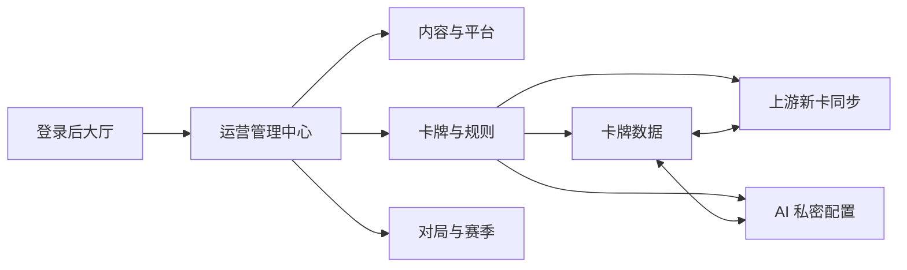
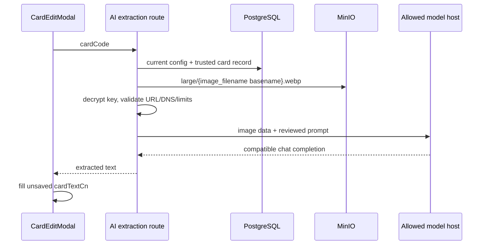

# 运营管理中心、上游同步与 AI 私密配置设计

> 文档类型：设计文档
> 适用范围：统一管理导航、上游新卡同步、AI 配置持久化、服务端提取链路与安全边界
> 当前状态：现行实现

## 1. 页面结构

`AdminCenterPage` 是管理员模块目录，不持有业务状态。目录以一层分组列表直接呈现全部工具，不再叠加首屏宣传区、页内分类导航或独立移动端选择器。`App.tsx` 继续负责当前页面选择，各模块复用既有组件；主页只链接管理中心，各模块通过 `AdminPageHeader` 使用一致的分类提示和返回入口。`CardSyncAdminPage`、`AiEffectExtractionAdminPage` 与 `CardAdminPage` 作为相邻入口，新卡导入、AI 配置与卡牌编辑仍是三个独立页面。

## 2. 上游新卡任务

`CardSyncAdminPage` 通过 `GET /api/admin/card-sync/status`、`POST /api/admin/card-sync/previews`、`POST /api/admin/card-sync/runs` 和 `GET /api/admin/card-sync/runs/:runId` 完成配置检查、持久化预览、逐卡选择、二次确认和轮询恢复。预览默认选择无 warning 的候选，管理员可全选、清空或逐卡调整；确认弹窗单独提示所选 warning 卡数量。创建任务时路由只额外接受当前预览内的 `cardCodes` 子集，不接收集合名、发布状态、跳过图片或覆盖策略；服务端重新验证子集归属，并将完整预览候选集与所选子集一同绑定到任务，供 worker 执行前校验。

`CardSyncWorker` 认领任务时生成随机 lease token 并递增 generation，心跳只能续租同 token/generation 的 `RUNNING` 记录。回收逾期任务会递增 generation 并清空租约；逐卡写库与结果持久化都要在事务中带 token/generation 续租并锁定任务行。图片处理在下载、压缩和每次对象操作前后检查租约；如果旧 worker 在一次对象写入后才观测到 fencing，则保留带内容哈希的不可变对象供后续任务安全复用，不允许旧 worker 删除后续任务已复用的对象。

## 3. 持久化与原子保存

- `ai_effect_extraction_config` 是 `id='default'` 的单例行，保存 revision、启用状态、Base URL、Model ID、API Key 密文和更新人。
- `ai_effect_extraction_audit_logs` 追加保存前后 revision、管理员和不含秘密的变更摘要。
- `PUT /api/ai-effect-extraction/admin/config` 在事务中锁定单例行，比较 `expectedRevision`，更新配置并追加审计；任一步失败即回滚。
- Key 操作是 `KEEP | REPLACE | CLEAR` 判别联合。`REPLACE` 使用 AES-256-GCM、随机 96 位 IV、认证标签和固定 AAD 形成版本化密文 envelope；服务端不返回 envelope。

## 4. API

| 方法   | 路径                                      | 用途                                       |
| ------ | ----------------------------------------- | ------------------------------------------ |
| `GET`  | `/api/ai-effect-extraction/admin/config`  | 返回非秘密配置、Key 是否存在和部署就绪状态 |
| `PUT`  | `/api/ai-effect-extraction/admin/config`  | 以 revision 乐观锁原子保存配置             |
| `POST` | `/api/ai-effect-extraction/admin/test`    | 调用候选配置，不保存                       |
| `POST` | `/api/ai-effect-extraction/admin/extract` | 仅接受 `cardCode`，读取可信卡图并提取文本  |

四个端点都在 router 级执行 `requireAuth + requireAdmin`，响应禁止缓存。错误只返回稳定代码和适合管理员处理的中文信息，不透传上游正文。

## 5. 提取链路

`AiEffectExtractionService` 不缓存数据库配置。Base URL 在候选测试、保存和每次调用时验证；调用使用 `redirect: manual`、AbortController、响应流大小上限、服务实例并发计数和管理员滚动窗口限频。图片按流读取并在编码前执行大小上限。

## 6. 部署配置

| 环境变量                              | 作用                                      |
| ------------------------------------- | ----------------------------------------- |
| `AI_EFFECT_EXTRACTION_ENCRYPTION_KEY` | 64 位 hex 或 base64 的 32 字节配置主密钥  |
| `AI_EFFECT_EXTRACTION_ALLOWED_HOSTS`  | 逗号分隔的精确上游主机允许列表            |
| `CLOUDBASE_ENV_ID`                    | 上游 CloudBase 环境 ID，只注入 API 进程   |
| `CLOUDBASE_SECRET_ID`                 | 上游 CloudBase 正式密钥 ID，不接受旧别名  |
| `CLOUDBASE_SECRET_KEY`                | 上游 CloudBase 正式密钥 Key，不接受旧别名 |

环境主密钥只在服务端进程中读取，不写数据库；运行时 Base URL、Model ID 和 Key 不再从环境变量 fallback。上游固定要求公开 HTTPS 地址，不提供私网或 HTTP 例外；15 秒请求超时、256 KiB 响应上限、4 MiB 卡图上限和单实例 2 请求并发均为代码中的固定安全边界，不作为生产运维旋钮。

## 7. 关键代码

| 路径                                                          | 职责                                                |
| ------------------------------------------------------------- | --------------------------------------------------- |
| `client/src/components/admin/AdminCenterPage.tsx`             | 管理中心目录与分类导航                              |
| `client/src/components/admin/CardSyncAdminPage.tsx`           | 新卡预览、二次确认、执行状态与逐卡结果              |
| `client/src/components/admin/AdminPageHeader.tsx`             | 管理子页面的分类提示、返回入口和页面级操作          |
| `client/src/components/admin/AiEffectExtractionAdminPage.tsx` | 私密配置状态、候选测试与保存                        |
| `client/src/lib/aiService.ts`                                 | 本站管理员 API 客户端                               |
| `src/server/routes/ai-effect-extraction.ts`                   | 严格输入、管理员门禁与错误映射                      |
| `src/server/services/ai-effect-extraction-service.ts`         | 加密、事务、SSRF 边界、模型调用与可信图片读取       |
| `src/server/services/card-sync-worker.ts`                     | 任务认领、心跳、超时回收、租约 fencing 与结果持久化 |
| `src/server/services/cloudbase-card-sync-engine.ts`           | 固定新卡策略、上游规划、卡图处理与事务写入          |
| `src/server/db/schema.ts`                                     | 配置单例与审计表                                    |
| `drizzle/0023_add_ai_effect_extraction_config.sql`            | 数据库增量迁移                                      |
