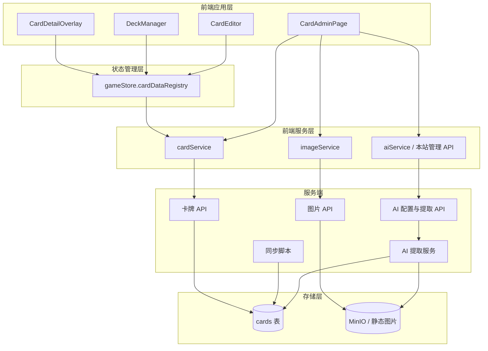

# 卡牌数据管理系统 - 设计文档

> 版本: 1.5.0
> 创建日期: 2026-03-03
> 更新日期: 2026-08-14
> 文档类型: 设计文档
> 适用范围: 卡牌数据模型、管理端、前端服务、同步脚本与图片能力
> 当前状态: 主体已实现；部署与迁移边界见 [数据库迁移说明](../../drizzle/README.md)

本文档说明卡牌数据管理系统的架构与设计边界，不维护具体 SQL、接口实现或组件内部状态。当前代码事实以相关代码路径为准。

## 1. 设计目标

- 为对局、卡组编辑、卡牌管理和同步脚本提供统一的卡牌数据来源。
- 区分管理态与玩家态：管理员可以维护 DRAFT/PUBLISHED 卡牌，普通对局与构筑只消费已上线卡牌。
- 让结构化字段服务于规则计算、筛选和展示；非规则字段不进入对局逻辑。
- 支持外部数据同步、人工修订、图片上传和 AI 辅助录入，但这些能力不改变领域模型边界。

## 2. 系统架构

## 3. 领域模型

卡牌以 `cardCode` 为稳定标识，并按 `CardType` 分为三类：

| 类型   | 主要用途                         | 关键结构化字段                                         |
| ------ | -------------------------------- | ------------------------------------------------------ |
| MEMBER | 成员卡、费用、应援棒与心图标规则 | cost、blade、hearts、bladeHearts、groupNames、unitName |
| LIVE   | Live 成功判定与分数展示          | score、requirements、bladeHearts、groupNames、unitName |
| ENERGY | 能量牌组与能量区展示             | groupNames、unitName、product                          |

通用字段包括中日名称、中日效果文本、作品名、真实团体、图片文件名、稀有度、收录商品和发布状态。`rare` 与 `product` 用于管理、展示和筛选，不参与对局规则计算。

领域对象仍保留 `name`、`cardText` 作为运行时展示字段。这些字段由读取转换层按 `name_cn/name_jp`、`card_text_cn/card_text_jp` 派生，数据库不再持久化重复的 `name`、`card_text`、`group_name` 单列。真实团体只通过结构化 `groupNames` 暴露。

特殊点数不属于卡牌表字段，也不进入通用卡牌实体；点数规则由独立的版本化 PT 表与构筑规则模块维护，仅使用 PUBLISHED 卡牌校验基础编号是否存在，避免把构筑限制写入基础卡牌资料。

## 4. 状态与可见性

卡牌维护存在两个状态：

| 状态      | 含义                     | 可见性                 |
| --------- | ------------------------ | ---------------------- |
| DRAFT     | 未完成、待校对或暂不开放 | 仅管理员可见           |
| PUBLISHED | 可用于构筑与对局         | 普通用户与游戏流程可见 |

构筑、对局及其他消费运行时卡池的页面只加载 PUBLISHED 卡牌到 `gameStore.cardDataRegistry`。独立管理页不在应用启动阶段等待完整卡池，而是使用各自的数据接口；卡牌管理页可以查看和维护全部状态。

## 5. 数据转换

系统在数据库记录、前端输入和领域模型之间保持明确转换边界：

- 数据库存储使用后端 schema 定义的持久化字段，卡名、效果文本、作品名与真实团体按多语言和数组字段分列保存。
- 前端服务负责把持久化记录转换为 `AnyCardData` 领域对象，并派生旧运行时展示字段。
- 管理端表单/YAML 编辑器负责把人工输入约束到可提交形态；服务端写入接口当前主要校验权限、基础字段和状态枚举。
- `hearts`、`blade_hearts`、`requirements` 等 JSON 结构字段当前仍以管理端转换、领域 schema、同步脚本和后续读取转换作为主要约束，API 写入层尚未形成完整结构强校验。
- 读取、导出和同步边界会对同类型、同基础编号卡牌缺失的 `blade_hearts` 做派生补全；该补全属于业务读取视图，不改变数据库持久字段和写入接口的显式值语义。
- 同步脚本只在同步边界处理外部字段名和历史字段名，不把外部数据源结构泄漏到 REST API 或领域模型。

## 6. 前端职责

| 模块                       | 职责                                                                       |
| -------------------------- | -------------------------------------------------------------------------- |
| CardAdminPage              | 服务端分页与筛选的轻量列表、按需详情编辑、发布状态切换、导出和图片维护入口 |
| CardEditModal              | 表单/YAML 双模式编辑，负责把人工输入约束到卡牌模型可接受的形态             |
| card-filters               | 管理页与卡组编辑器共享的无状态搜索框、卡牌类型选择等筛选展示组件           |
| cardService                | 运行时卡池、管理摘要分页、按需详情、缓存和记录到领域模型的转换             |
| gameStore.cardDataRegistry | 对局和构筑时的只读卡牌资料注册表                                           |
| imageService               | 卡牌图片 URL 解析和尺寸选择                                                |
| aiService                  | 只调用本站管理员 API；提交卡号并接收待确认的效果文本                       |

## 7. 服务端职责

- 卡牌 API 负责卡牌资料的读取、创建、更新、删除、发布状态切换和批量导入导出。
- 普通读取只暴露 PUBLISHED 卡牌；管理读取可包含 DRAFT。
- 管理列表只查询当前页所需的编号、类型、名称、图片、稀有度、状态和更新时间；搜索、类型、状态与分页都在数据库侧完成。
- 单卡详情只查询当前卡和同类型、同基础编号的卡牌，以补全读取视图中缺失的 `blade_hearts`；运行时卡池和管理导出仍返回完整业务读取视图。
- 管理端批量状态切换由服务端按当前筛选条件执行一次集合更新，不逐卡发起请求。
- 所有写操作要求管理员权限。
- 图片 API 只处理上传、删除与对象存储写入；图片公开读取通过 `/images/*` 路径完成。
- 卡牌 API 将 CloudBase 版本化图片标记视为服务端内部派生状态；创建和批量导入会剔除外部同名键，更新时只在图片文件名未变且现有标记校验通过时保留，普通换图会清除。
- AI 配置与提取 API 只接受管理员请求。服务端按请求读取 PostgreSQL 私密配置和 MinIO 可信卡图，执行上游白名单、DNS 地址、HTTPS、重定向、超时、并发、限频和响应大小校验。
- API Key 使用部署主密钥进行 AES-256-GCM 认证加密；管理读取只返回是否已配置，候选测试不保存，配置保存使用 revision 乐观锁与事务审计。
- 服务端 schema 是持久化结构的权威来源，初始化脚本或历史迁移不应与其长期分叉。

## 8. 同步与外部数据

当前维护三条批量同步通道：

- `src/scripts/sync-cards-llocg.ts` 负责读取 `llocg_db` JP/CN JSON、标准化卡号、合并中文补充数据、转换结构化规则字段，并在写入前对已有卡牌差异进行人工审核。
- `src/scripts/sync-cards-loveca-excel.ts` 负责读取 Loveca Excel 或 CloudBase `loveca` 的来源权威卡牌类型、中日名称、中日效果文本、真实团体、真实小队、商品和来源字段；不读取 Excel 官方 `作品名` / `参加ユニット`，也不覆盖费用、BLADE、LIVE 分数等其他对局规则字段。
- `src/scripts/sync-cards-cloudbase-new.ts` 负责从 CloudBase 卡牌集合插入 DB 不存在的新卡，默认写入 `DRAFT`，可选下载、压缩并上传卡图；它不更新已有卡牌，也不登记卡效。

同步脚本会影响卡牌基础资料和发布状态，因此属于高风险维护入口。具体字段映射与运行边界见 [卡牌数据同步需求](../card-data-sync/requirements.md) 和 [卡牌数据同步管线](../card-data-sync/design.md)。

## 9. 安全边界

- 普通用户只能读取已发布卡牌。
- 管理员可以读取和修改草稿、已发布卡牌以及批量数据。
- 前端不持有第三方 AI 或对象存储密钥。
- AI 识别和图片上传只能作为管理端辅助能力，不能绕过管理端确认与卡牌字段约束。
- 外部数据同步必须经过标准化和差异审核，避免静默覆盖人工修订。

## 10. 已知限制

- 卡牌写入 API 对结构化 JSON 字段仍是宽松透传；若要把字段规范作为服务端强契约，需要在写入路由补齐对应 schema 校验。
- 同步脚本以外部数据为主源，运行前需要确认是否会覆盖人工维护的 DRAFT 内容。
- 图片 URL 解析和对象存储策略依赖 MinIO 文档中定义的路径约定。
- 数据库初始化、Drizzle schema 和历史迁移之间的差异见 [数据库迁移说明](../../drizzle/README.md)。

## 11. 相关代码路径

| 路径                                                          | 说明                                        |
| ------------------------------------------------------------- | ------------------------------------------- |
| `client/src/lib/cardService.ts`                               | 前端卡牌服务、缓存与数据转换                |
| `client/src/lib/aiService.ts`                                 | AI 管理配置与效果提取本站 API 客户端        |
| `client/src/components/admin/AiEffectExtractionAdminPage.tsx` | AI 私密配置管理页                           |
| `client/src/lib/imageService.ts`                              | 图片 URL 与尺寸解析                         |
| `client/src/components/admin/CardAdminPage.tsx`               | 管理页面入口                                |
| `client/src/components/card-filters/`                         | 跨卡牌页面共享的无状态筛选展示组件          |
| `client/src/components/deck-editor/use-card-filters.ts`       | 卡组编辑器完整卡池的客户端筛选状态与计算    |
| `client/src/store/gameStore.ts`                               | `cardDataRegistry` 所在状态模块             |
| `src/domain/entities/card.ts`                                 | 卡牌领域模型                                |
| `src/domain/card-data/schema.ts`                              | 卡牌数据校验 schema                         |
| `src/domain/card-data/loader.ts`                              | 卡牌注册表结构与按编号/名称查找能力         |
| `src/domain/rules/deck-construction.ts`                       | 消费显式 PT 表快照的构筑点数计算            |
| `src/domain/rules/deck-point-table.ts`                        | 版本化 PT 表的领域契约与校验                |
| `src/server/db/schema.ts`                                     | 持久化 schema                               |
| `src/server/routes/ai-effect-extraction.ts`                   | AI 管理与提取路由                           |
| `src/server/services/ai-effect-extraction-service.ts`         | 加密、事务、可信图片与上游安全调用          |
| `src/server/routes/cards.ts`                                  | 卡牌 API 路由                               |
| `src/server/services/card-registry-service.ts`                | 后端从数据库加载并缓存 PUBLISHED 卡牌注册表 |
| `src/scripts/sync-cards-llocg.ts`                             | `llocg_db` 卡牌同步脚本                     |
| `src/scripts/sync-cards-loveca-excel.ts`                      | Loveca Excel 中日文本与来源字段同步脚本     |
| `src/scripts/sync-cards-cloudbase-new.ts`                     | CloudBase-only 新卡导入与卡图上传脚本       |

## 12. 相关文档

- [需求文档](./requirements.md)
- [卡牌数据规格](./data-spec.md)
- [卡牌数据同步需求](../card-data-sync/requirements.md)
- [卡组管理系统设计](../deck-management/design.md)
