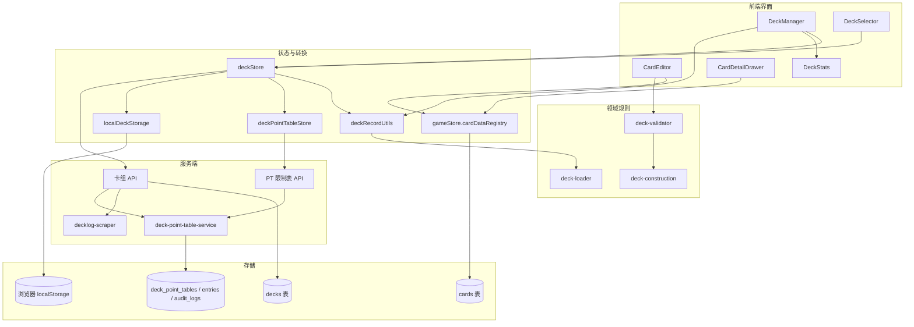
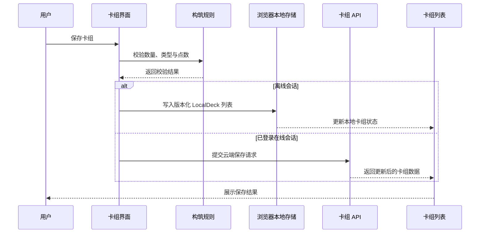
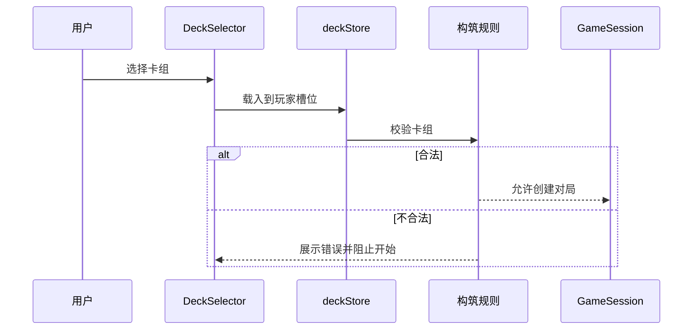

# 用户卡组管理系统 - 设计文档

> 版本: 1.6.0
> 创建日期: 2026-03-03
> 最后更新: 2026-09-07
> 文档类型: 设计文档
> 适用范围: 卡组管理 UI、deckStore、浏览器本地卡组、卡组 API、PT 限制表、分享/复制与 DeckLog 导入能力
> 当前状态: 已实现；部署和 schema 差异见 [数据库迁移说明](../../drizzle/README.md)

本文档说明卡组管理系统的架构、数据边界和关键设计取舍，不维护具体 SQL、接口参数、React 状态变量或函数级实现细节。

## 1. 设计目标

- 支持玩家创建、编辑、保存、选择和删除自己的卡组。
- 保证构筑规则在保存、展示和进入游戏前得到一致校验。
- 允许卡组在浏览器本地记录、云端记录和分享页之间转换，但不暴露数据库结构给 UI。
- 支持公开分享、复制到自己账号，以及从 DeckLog 导入卡表作为编辑起点。
- 与卡牌数据管理系统共享 PUBLISHED 卡牌资料，避免草稿卡进入普通构筑流程。

## 2. 系统架构

## 3. 数据模型

卡组在系统内有三个主要形态：

| 形态         | 使用位置                   | 设计目的                                                    |
| ------------ | -------------------------- | ----------------------------------------------------------- |
| `DeckConfig` | 构筑、游戏入口、对局加载   | 面向领域规则，明确区分成员卡、Live 卡和能量卡               |
| `LocalDeck`  | 离线列表与浏览器本地持久化 | 包装 `DeckConfig`、本地 ID 与更新时间，不承载账号或分享语义 |
| `DeckRecord` | 云端持久化、分享、在线列表 | 面向存储与权限，包含所有者、分享状态、校验状态和更新时间    |

`DeckRecord` 与 `DeckConfig` 的转换由共享领域工具 `src/domain/card-data/deck-record-utils.ts` 维护，客户端通过 `client/src/lib/deckRecordUtils.ts` 复用该实现。转换层负责主卡组中 MEMBER/LIVE 的分流，以及保存时的持久化形态整理。`getMainDeckEntryType` 优先读持久化 `card_type`，其次调用类型 resolver；两者都没有结果时，仍按 `PL` 前缀猜为 LIVE，其余猜为 MEMBER。该前缀不是可靠的类型契约，这属于待收束的实现偏差，不能作为新增旧格式兼容的规范。服务端 `normalizeDeckRecordPayload` 则查询实际卡牌类型并拒绝不存在、未发布或类型不符的输入，不使用该前缀猜测。云端卡组另保留最近一次服务端校验使用的 PT 表版本；候场票据与对局卡组快照则冻结版本、总点数和上限，便于后续追溯。

`LocalDeck` 使用带显式版本号的整体结构写入当前浏览器。读取时通过 `DeckConfigSchema` 校验完整数据，非当前版本或形状不合法的数据不进入应用状态。本地列表和对局选组仍使用当前卡牌注册表与离线 PT 表重新判定合法性，不信任存储中的派生结果。

## 4. 构筑规则

卡组验证由领域规则模块统一维护，UI 只消费验证结果：

- 主卡组必须满足成员卡与 Live 卡的数量要求。
- 能量卡组必须满足固定张数要求。
- 同基础编号的卡牌在主卡组中合计不能超过上限，不同稀有度视为同一基础编号。
- 主卡组不能包含能量卡；能量卡组只能包含能量卡。
- 特殊点数按基础编号计算，卡组总点数不能超过当前生效 PT 表的规则上限。

基础编号提取由共享工具维护，确保构筑、统计和展示中的“同卡”定义一致。PT 表是独立的版本化领域数据，不属于卡牌基础资料；任何成功管理操作后都必须有且仅有一张 ACTIVE 表，并最多保留一张 SCHEDULED 表。定时版本接收精确到秒的北京时间（`Asia/Shanghai`）；管理员可修改任意生命周期的表内容及已发布表的生效时间。排期表被调整到当前或过去时在同一事务内立即切换；废弃 ACTIVE 表必须原子提升另一张替代表，不允许出现无 ACTIVE 表的已提交状态。

## 5. 前端职责

| 模块                     | 职责                                                                                    |
| ------------------------ | --------------------------------------------------------------------------------------- |
| DeckManager              | 根据会话管理浏览器本地或云端卡组，并提供创建、编辑、删除、导入导出、分享与 DeckLog 入口 |
| CardEditor               | 卡牌浏览、筛选、添加/移除、卡组预览和详情查看                                           |
| DeckStats                | 数量、点数、校验状态和更新时间等摘要展示                                                |
| DeckSelector             | 游戏开始前选择本地或云端卡组                                                            |
| deckStore                | 浏览器本地卡组与云端卡组的加载/保存，以及本地玩家槽位和当前编辑状态                     |
| deckPointTableStore      | 读取普通玩家可见的当前 PT 表，并在真正离线或启动接口不可用时提供已确认的内置展示快照    |
| deckRecordUtils          | 云端记录与领域卡组配置之间的转换                                                        |
| DeckPointTablesAdminPage | 管理任意状态的 PT 表、差异预览、立即/定时发布、取消排期、废弃/替换、删除与历史复制      |

卡牌浏览与构筑只使用 `gameStore.cardDataRegistry` 中的 PUBLISHED 卡牌，因此普通玩家不能把 DRAFT 卡加入卡组。

## 6. 卡牌筛选与预览

卡牌编辑器围绕高频构筑操作设计：

- 按卡牌类型分区浏览。
- 支持名称、编号、稀有度、组合、小组、费用、心颜色、BLADE 心效果、分数和收录商品等筛选维度。
- 成员卡、Live 卡和能量卡展示适合自身类型的筛选项。
- 卡组预览按类型和规则相关字段排序，帮助玩家快速检查曲线、分数和能量构成。
- 同基础编号计数在浏览区和卡组区保持一致，避免不同稀有度变体绕过数量上限。

## 7. 服务端与权限

卡组 API 以登录用户为隔离边界：

- 用户只能管理自己的卡组。
- 管理员可进行必要的维护操作；当前服务端支持按已知卡组 ID 读取、修改、删除和维护分享状态，尚未提供管理员全量列表或审核工作台。
- 公开或开启分享的卡组可以被非所有者读取。
- 分享卡组可被登录用户复制到自己的账号，复制后与原卡组独立维护。
- 卡组保存会记录校验状态和校验错误，允许未完成卡组暂存，但进入对局前仍需满足规则。
- 服务端保存、更新和复制分享卡组时会基于当前 PUBLISHED 卡池和当前 ACTIVE PT 表重新规范化卡组记录并计算 `is_valid` / `validation_errors`；客户端提交的派生校验字段不作为可信事实。
- 锁组或公共候场会冻结当时的 PT 版本、总点数和上限；真正创建新对局、公共候场 bootstrap 和对墙打重开前会再以当前 ACTIVE 表重验运行时快照。旧快照在新表下仍合法时更新事实后开局，不合法时在创建新对局或封存旧对墙打之前阻止。
- PT 表管理路由只对管理员开放，写操作使用 revision 乐观锁并记录审计日志。发布还必须带上差异预览时看到的 ACTIVE 表 ID，若期间已有其他版本生效则返回冲突并要求重新预览。普通公开接口只返回当前规则所需的版本、生效时间、上限和基础编号点数。

服务端 schema 与初始化脚本的差异不在本文重复维护，见 [数据库迁移说明](../../drizzle/README.md)。

## 8. 数据流程

### 8.1 保存流程

### 8.2 选择进入游戏流程

## 9. 分享与复制

分享能力采用“公开可读、复制后独立”的模型：

- 卡组所有者可以开启或关闭分享。
- 分享链接暴露的是只读卡组信息。
- 登录用户可以把分享卡组复制到自己的账号。
- 复制卡组保留来源信息，便于后续展示来源关系，但复制后的修改不影响原卡组。
- 关闭分享后，原分享链接不应继续作为公开入口。

## 10. DeckLog 导入

DeckLog 导入是辅助构筑入口，而不是持久化事实来源：

- 前端接收 DeckLog 来源选择、ID 或 URL；当前来源覆盖日版 DeckLog 与国际版 DeckLog。
- 服务端根据来源代理访问对应 DeckLog API，并标准化卡号。
- URL 中可推断来源时，服务端会校验 URL 来源与用户选择一致，避免同一短码跨站撞号导致导入错误卡组。
- 前端用当前卡牌注册表匹配卡牌类型。
- 可匹配卡牌进入卡组编辑器；未匹配卡牌以警告形式提示。
- 导入结果需要玩家再次检查和保存。

该能力依赖 DeckLog 的外部数据结构，稳定性低于项目内部数据。外部结构变化时，应优先修复导入服务，而不是改变卡组领域模型。

## 11. 已知限制

- DeckLog 导入依赖外部站点接口，不能视为稳定契约。
- 浏览器本地卡组不会同步到账号或其他设备，清除站点数据会丢失记录；YAML 导出是当前用户可控的备份路径。
- 浏览器本地卡组、云端卡组和分享卡组之间存在转换边界，新增字段时必须同步检查存储 schema 与转换层。
- 未完成卡组可以保存，但不能绕过进入游戏前的构筑校验。
- 图片下载 ZIP 能力当前不作为已实现能力维护；若恢复，需要重新确认权限、文件命名和失败策略。

## 12. 相关代码路径

| 路径                                                       | 说明                                                              |
| ---------------------------------------------------------- | ----------------------------------------------------------------- |
| `client/src/components/deck/DeckManager.tsx`               | 卡组管理页面                                                      |
| `client/src/components/common/DeckStats.tsx`               | 卡组统计与状态展示                                                |
| `client/src/components/common/DeckSelector.tsx`            | 游戏开始前卡组选择                                                |
| `client/src/components/deck-editor/CardEditor.tsx`         | 卡组编辑器                                                        |
| `client/src/components/deck-editor/CardDetailDrawer.tsx`   | 编辑器与分享页卡牌详情                                            |
| `client/src/store/deckStore.ts`                            | 卡组状态管理                                                      |
| `client/src/store/deckPointTableStore.ts`                  | 当前 PT 表客户端快照                                              |
| `client/src/components/admin/DeckPointTablesAdminPage.tsx` | PT 表管理页                                                       |
| `client/src/lib/deckRecordUtils.ts`                        | 客户端复用共享卡组记录转换工具的出口                              |
| `client/src/lib/localDeckStorage.ts`                       | 浏览器本地卡组的版本化读写与结构校验                              |
| `client/src/lib/apiClient.ts`                              | REST 客户端与卡组记录类型                                         |
| `src/domain/card-data/deck-record-utils.ts`                | `DeckRecord` 与 `DeckConfig` 转换、旧格式规范化和服务端保存前校验 |
| `src/domain/card-data/deck-loader.ts`                      | `DeckConfig` 与卡组加载模型                                       |
| `src/domain/rules/deck-validator.ts`                       | 卡组基础验证规则                                                  |
| `src/domain/rules/deck-construction.ts`                    | 构筑限制与点数规则                                                |
| `src/domain/rules/deck-point-table.ts`                     | PT 表领域契约、校验、差异与北京时间转换                           |
| `src/shared/utils/card-code.ts`                            | 基础卡号提取                                                      |
| `src/server/routes/decks.ts`                               | 卡组 API 路由                                                     |
| `src/server/services/deck-storage-service.ts`              | 服务端卡组保存前规范化与发布卡池校验                              |
| `src/server/routes/deck-point-tables.ts`                   | 公开当前 PT 表与管理员版本管理 API                                |
| `src/server/services/deck-point-table-service.ts`          | PT 表状态机、发布、生效解析与审计                                 |
| `src/server/services/deck-point-snapshot-validation.ts`    | 锁定运行时卡组在新 ACTIVE PT 表下的开局/重开重验                  |
| `src/server/services/decklog-scraper.ts`                   | DeckLog 导入服务                                                  |
| `src/server/db/schema.ts`                                  | 持久化 schema                                                     |
| `src/scripts/normalize-deck-records.ts`                    | 生产卡组记录检查与旧格式迁移脚本                                  |

## 13. 相关文档

- [需求文档](./requirements.md)
- [卡组分享方案](./share-plan.md)
- [卡牌数据管理系统设计](../card-data-management/design.md)
