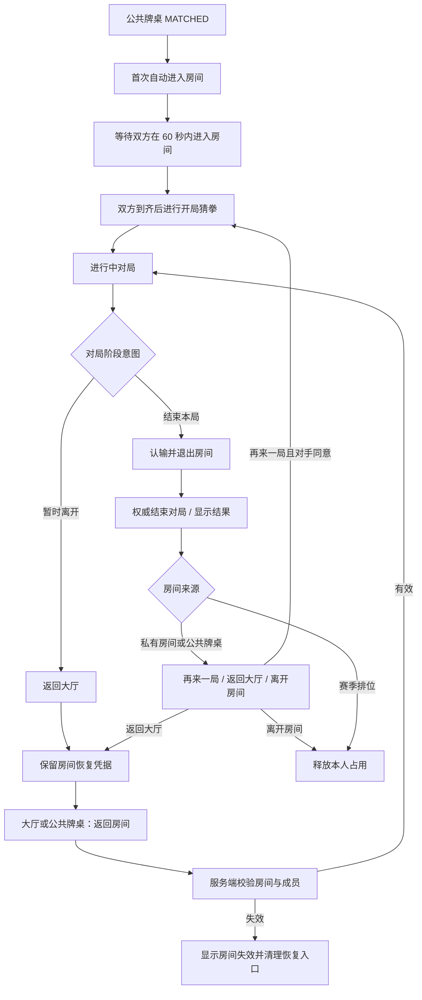

# 联机房间返回、退出与恢复设计

> 文档类型：设计文档
>
> 适用范围：正式联机房间、公共牌桌与赛季排位配对后的联机房间、主页与配对页面的房间恢复入口
>
> 当前状态：现行实现与评审基准
>
> 最后更新：2026-08-06

## 1. 文档目的

本文档统一说明玩家离开联机页面、退出赛前房间、放弃公共牌桌配对和再次返回房间时的产品语义。它是以下事实的权威说明：

- “返回大厅”和赛前“退出房间 / 放弃配对”分别意味着什么；
- “认输”与暂时返回大厅分别意味着什么；
- 哪些操作保留房间，哪些操作会改变服务端成员或配对状态；
- 主页、公共牌桌和全局配对层如何提供房间恢复入口；
- 公共牌桌各状态必须向玩家提供什么下一步操作；
- 评审相关改动时应验证哪些行为。

公共牌桌的候场、确认、配桌与恢复限制以本文和已落地服务端实现为准；正式联机的权威状态、玩家视角和同步边界仍由[联机模式准备文档](preparation.md)说明。

## 2. 要解决的问题

### 2.1 一个“离开”同时表达了两种意图

玩家在房间中可能只是想回主页查看卡组、历史记录或其他入口，也可能确实想退出当前房间。旧交互只提供“离开房间”，导致同一个按钮同时承担：

- 页面导航；
- 清除客户端恢复凭据；
- 调用服务端离开命令；
- 在公共牌桌开局阶段结束整次配对。

这些后果差异很大，不能继续使用同一个动作名称。

### 2.2 公共牌桌 `MATCHED` 状态缺少下一步

公共牌桌已经完成配桌后，持久票据可能仍投影为 `MATCHED`。旧页面把所有非 `WAITING` 状态统一显示为“找到对手 / 请确认是否开始”，但只为 `WAITING` 提供按钮，因此会出现：

- 已经完成确认和房间创建，却仍提示再次确认；
- 页面只有状态说明，没有进入房间的入口；
- 客户端已经清除房间恢复凭据时，玩家无法从页面恢复。

### 2.3 全局自动引导会覆盖玩家导航

公共牌桌全局层在看到 `MATCHED` 时会把玩家带入联机房间。若同一个匹配结果在组件重渲染时被重复消费，玩家即使已经返回大厅，也会再次被带回房间，形成无法离开的导航循环。

### 2.4 客户端状态与服务端状态没有及时重新对齐

真正放弃公共牌桌配对后，客户端可能仍持有放弃前的 `MATCHED` 视图。若公共牌桌页面不主动刷新服务端状态，就会继续展示已经失效的房间和错误操作。

## 3. 产品术语与硬性需求

### 3.1 返回大厅

未结束对局中的“返回大厅”只改变当前客户端页面，不发送服务端离开命令。赛季排位的进行中对局必须先提示：返回后可在 1 分钟内恢复，超时未返回会判负。权威对局已经结束时按房间来源区分：私有 `ONLINE_ROOM` 与公共牌桌的“返回大厅”继续保留房间号和恢复入口，方便双方回到同一房间再来一局；赛季排位的“返回大厅”会先执行服务端离开命令、释放本人的真人对局占用，再完成导航。

必须满足：

- 未结束时保留当前房间号恢复凭据；私有房间与公共牌桌赛后返回大厅也继续保留；赛季排位赛后成功释放后清除；
- 赛季排位进行中返回大厅前，确认框只说明 1 分钟恢复期限和超时判负；双方超时的例外仍由赛季公告说明；
- 停止当前页面的轮询和桌面同步；
- 大厅显示“返回房间”入口；
- 公共牌桌仍为 `MATCHED` 时，公共牌桌页面显示房间号和“返回房间”；
- 玩家再次进入后，由服务端重新确认成员身份和当前房间状态。

私有房间与公共牌桌赛后必须在结果面板直接提供“再来一局”。该动作复用双方同意的重开请求：发起方等待对手回应，对手可直接同意或拒绝；同意后封存旧局并回到同一房间的准备阶段。对手暂时不在房间时保留入口，但需说明等待对手返回，不能让失败只表现为通用错误。

### 3.2 赛前退出房间与放弃配对

普通房间准备阶段的“退出房间”表示玩家主动执行服务端离开命令，不等同于返回页面。开局猜拳页按沉浸式对局桌呈现，不显示顶部菜单、返回大厅或退出/放弃操作。未结束的 `IN_GAME` 对局不提供单独的“退出房间”：暂时离开使用“返回大厅”，主动结束则使用“认输并退出房间”。

必须满足：

- 操作前显示后果明确的确认框；
- 成功后清除客户端房间恢复凭据；
- 成功后返回大厅；
- 准备阶段按房间成员规则移除或转移房主；
- 失败时保留当前页面和恢复凭据，并显示可理解的错误。

准备阶段如果玩家希望稍后继续，应选择“返回大厅”，而不是执行赛前退出。

### 3.3 认输并退出房间

“认输并退出房间”是进行中真人对局的独立终局操作：先通过服务端权威命令认输，确认终局后立即离开房间并释放本人的真人对局占用。

- 仅参与者可在未结束的 `IN_GAME` 对局中发起；普通联机房间和公共牌桌房间使用同一服务端权威命令；
- 提交前明确确认“本局将立即结束，无法恢复。”；
- 成功后权威状态以 `OPPONENT_SURRENDER` 结束本局；对手显示“本局获胜 / 对方已认输。”，认输方随即离开房间；
- 对局记录标记为 `SURRENDERED`，不允许以退出、刷新或重新进入恢复本局；
- 认输方不保留房间恢复凭据；对手从赛后界面返回大厅时，私有房间与公共牌桌保留恢复入口，赛季排位释放旧房间占用；不能把暂时返回大厅误作认输。
- 首页存在房间恢复入口时，点击“另开本地对局”使用同一权威认输并离房流程；成功后清除恢复凭据，后续进入联机不会回到原房间。

## 4. 页面与动作矩阵

| 所在场景                              | 返回大厅                         | 退出/放弃                                | 恢复入口                                               |
| ------------------------------------- | -------------------------------- | ---------------------------------------- | ------------------------------------------------------ |
| 正式房间准备阶段                      | 保留房间号，不调用离开接口       | 退出房间；按成员规则移除当前成员         | 仅返回大厅后可“返回房间”；退出后需再次输入房间号       |
| 任意房间开局猜拳                      | 不提供页面内返回操作             | 不提供页面内退出/放弃操作                | 猜拳结束后进入对局桌继续操作                           |
| 正式联机或公共牌桌的进行中对局        | 保留房间号，稍后重新同步玩家视角 | 只提供认输并退出房间；立即结束且不可恢复 | 返回大厅后可恢复；认输方立即离开，对手赛后可返回大厅   |
| 已结束的私有 `ONLINE_ROOM` 或公共牌桌 | 保留房间号和恢复入口             | 明确确认后真正离开并释放本人占用         | 可从大厅返回；也可在赛后直接请求“再来一局”             |
| 已结束的赛季排位                      | 先释放本人旧房间占用，再返回大厅 | 不再显示独立“离开对局”                   | 不保留继续对局入口                                     |
| 公共牌桌已经 `MATCHED` 但不在房间页   | 不适用                           | 进入房间后再执行对应退出动作             | 公共牌桌显示房间号和“返回房间”                         |
| 已真正退出且房间已销毁                | 不适用                           | 不适用                                   | 不显示失效入口；玩家重新创建房间或重新进入公共牌桌候场 |

## 5. 公共牌桌状态与唯一下一步

公共牌桌页面不能把所有活动状态压缩成“找到对手”。每个状态必须提供与服务端含义一致的展示和操作：

| 状态                   | 主文案       | 必须提供的操作               |
| ---------------------- | ------------ | ---------------------------- |
| `IDLE`                 | 选择卡组     | 找对手                       |
| `WAITING`              | 正在找对手   | 取消等待                     |
| `PENDING_CONFIRMATION` | 找到对手     | 确认开局、取消等待           |
| `CONFIRMED`            | 你已确认     | 等待对方确认；仍允许取消等待 |
| `CREATING_ROOM`        | 正在进入房间 | 明确的加载反馈，不重复提交   |
| `MATCHED`              | 对局已准备好 | 显示房间号，并提供“返回房间” |

页面进入时必须主动读取一次服务端公共牌桌状态。在当前登录会话的首次读取成功前，页面不得展示卡组选择或沿用本地残留状态；读取失败时应保留明确的重试入口。真正退出公共牌桌房间后也应尽快刷新，以清除客户端残留的 `MATCHED` 视图。

## 6. 自动进入与手动恢复

### 6.1 自动进入只消费一次

公共牌桌首次进入 `MATCHED` 后，全局层可以自动把玩家带入房间。消费键由 `roomGeneration + roomCode` 组成。

同一个消费键不得因为以下原因再次触发自动导航：

- `App` 或全局层重渲染；
- 玩家从房间返回大厅；
- 玩家进入卡组、历史记录或其他站内页面；
- 公共牌桌 store 写入等价的 `MATCHED` 对象。

新的配对具有新的 `roomGeneration`，仍应正常自动进入。

自动进入只能消费当前登录用户已经完成首次读取的状态。公共牌桌客户端状态必须绑定当前用户；登录用户变化时立即清空旧状态，并使上一用户尚未返回的请求失效。首次读取失败、状态仍属于上一用户或尚未完成当前会话读取时，不得展示全局候场层、写入房间恢复凭据或触发自动进入。

### 6.2 手动恢复入口

客户端使用当前标签页的 `sessionStorage` 保存房间号。该凭据只负责发现“可能需要恢复的房间”，不代表服务端一定接受恢复。

恢复入口有两处：

1. 大厅：存在房间恢复凭据时，主操作显示“返回房间”；
2. 公共牌桌：服务端状态为 `MATCHED` 且包含房间号时，显示“返回房间”。

点击恢复入口后，联机页面仍须调用房间读取接口。成员身份、房间代际、房间是否存在以及对局是否仍运行，全部以服务端结果为准。

## 7. 交互流程

## 8. 状态职责

### 8.1 服务端

服务端负责：

- 房间、成员、席位、presence、房间代际和对局的权威状态；
- 公共牌桌 reservation、ticket 与房间绑定；
- 离开命令对不同房间阶段的实际影响；
- 拒绝不存在、已销毁、代际不匹配或无成员资格的恢复请求。

客户端不得仅凭保存的房间号宣称恢复成功。

### 8.2 客户端

客户端负责：

- 区分页面导航和服务端离开；
- 保存或清除当前标签页的房间恢复凭据；
- 根据公共牌桌状态显示唯一、可执行的下一步；
- 防止同一个 `MATCHED` 结果重复自动导航；
- 在退出、恢复失败或进入公共牌桌页面时重新读取服务端状态。

## 9. 当前限制

- 房间恢复凭据使用 `sessionStorage`，只在当前浏览器标签页会话中保留，不承诺跨设备或跨浏览器恢复。
- 正式联机房间和运行中 match 仍主要依赖服务端进程内状态；服务进程重启后的完整续局尚未实现。
- “返回大厅”可以保留进入房间的入口，但不延长服务端房间生命周期；长时间无人在线时房间仍会按现有清理策略结束。
- 已进入公共牌桌开局后，“返回大厅”保留恢复资格；“放弃配对”会终结本次匹配，不能再恢复旧房间。
- 房间号是恢复定位信息，不取代用户身份、房间代际和成员资格校验。

服务端对墙打的 checkpoint 恢复与历史回放边界见[回放设计](../match-replay/design.md)；正式联机的上述进程重启限制同样适用于复用房间运行态的公共牌桌、排位与主题活动。

## 10. 关键实现路径

- 应用级页面切换：`client/src/App.tsx`
- 公共牌桌全局等待、确认与自动进入：`client/src/components/public-table/PublicTableGlobalLayer.tsx`
- 公共牌桌状态页与“返回房间”：`client/src/components/pages/PublicTablePage.tsx`
- 正式联机房间、开局、对局操作与离开确认：`client/src/components/pages/OnlineRoomPage.tsx`
- 主页房间恢复入口：`client/src/components/pages/HomePage.tsx`
- 离开确认文案：`client/src/lib/leaveConfirmCopy.ts`
- 公共牌桌客户端状态：`client/src/store/publicTableStore.ts`
- 联机房间公开 DTO：`src/online/release-types.ts`
- 房间成员与离开生命周期：`src/server/services/online-room-service.ts`
- 公共牌桌票据与房间绑定：`src/server/services/public-table-service.ts`

## 11. 验收标准

评审相关改动时至少验证：

1. 公共牌桌 `PENDING_CONFIRMATION` 页面同时有“确认开局”和“取消等待”。
2. 公共牌桌 `MATCHED` 页面显示真实房间号和“返回房间”。
3. 公共牌桌双方确认后，先显示最多 60 秒的“等待对手进入房间”；双方到齐后才显示猜拳操作。
4. 开局猜拳页不显示顶部菜单、返回大厅、退出房间或放弃配对。
5. 未结束对局点击“返回大厅”不会调用离开接口，不会清除房间恢复凭据。
6. 返回大厅后可以从大厅进入原房间。
7. 从公共牌桌进入已匹配房间时，会恢复客户端房间凭据。
8. 公共牌桌开局中放弃配对后，旧房间、`MATCHED` 状态和双方旧房间占用均结束。
9. 同一个匹配结果不会在玩家返回大厅后再次强制跳转。
10. 新的公共牌桌匹配仍会自动进入一次。
11. 切换登录用户时不会展示或消费上一用户的候场、确认或 `MATCHED` 状态；上一用户的迟到响应也不会覆盖当前用户状态。
12. 公共牌桌页面首次状态读取失败时不会开放卡组选择，并提供重新读取入口。
13. 恢复请求被服务端拒绝时，页面显示明确错误并允许清理失效入口。
14. 桌面和移动端都能看见上述关键操作，键盘焦点与禁用状态清晰。
15. 进行中普通房间与公共牌桌房间只提供“返回大厅”和“认输”两种离开相关意图；直接调用离开接口会被拒绝。
16. 私有 `ONLINE_ROOM` 与公共牌桌对局结束后，结果面板直接提供“再来一局”“返回大厅”和“离开房间”，不要求玩家打开房间菜单寻找重开入口。
17. 私有房间与公共牌桌赛后“返回大厅”不调用离开接口、不清除房间恢复凭据；从大厅可以返回原房间。
18. 私有房间与公共牌桌赛后“离开房间”先确认后释放本人占用；双方均离开后旧运行态立即清理。
19. 赛季排位赛后点击“返回大厅”仍释放本人旧房间占用，不显示再来一局入口。

## 12. 维护规则

以下变化必须同步更新本文档：

- “返回大厅”“退出房间”或“放弃配对”的后果变化；
- “认输”、赛后结果或战绩终局状态变化；
- 房间恢复凭据的存储方式或生命周期变化；
- 公共牌桌状态机或 `MATCHED` 自动进入策略变化；
- 正式联机进程重启恢复、跨设备恢复或持久房间恢复落地；
- 服务端离开命令对 `PREPARING`、`OPENING`、`IN_GAME` 的处理变化。

纯样式调整、组件拆分或不改变上述外部行为的重构不需要更新本文档。
