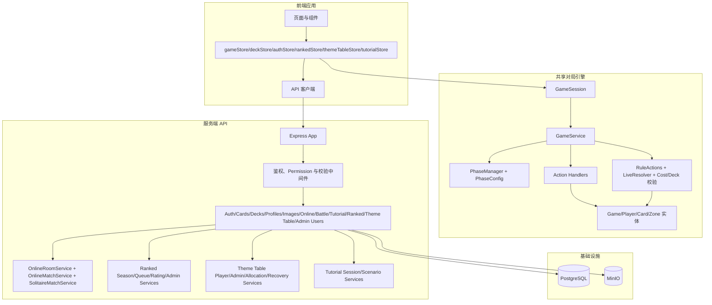
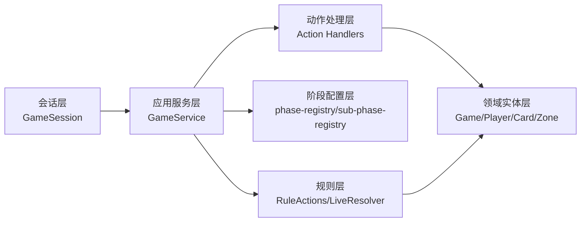
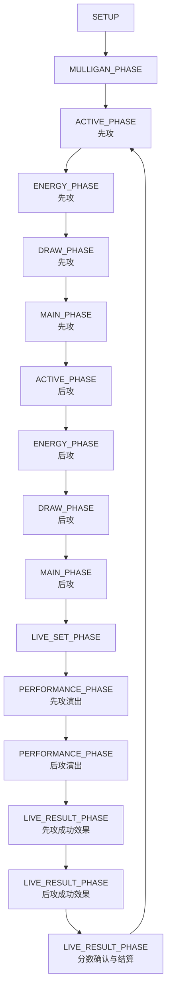
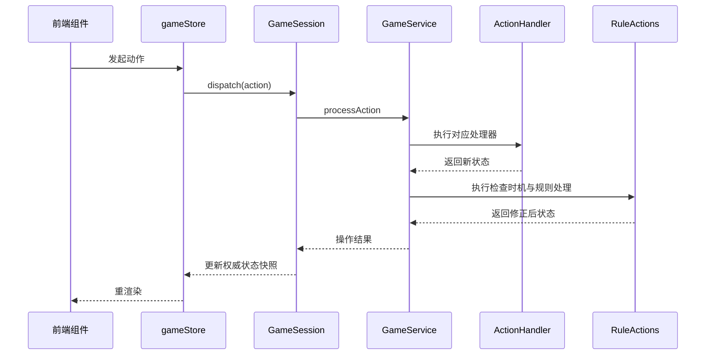
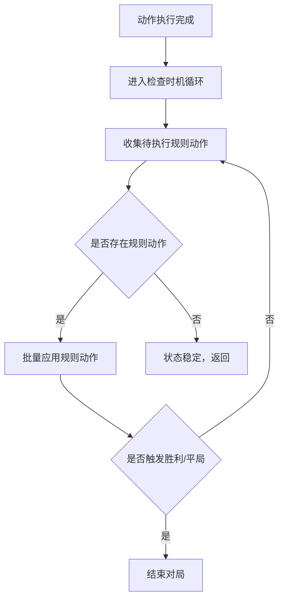
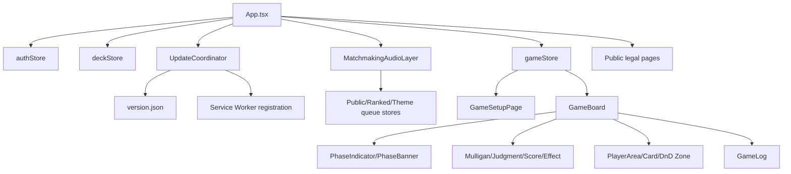
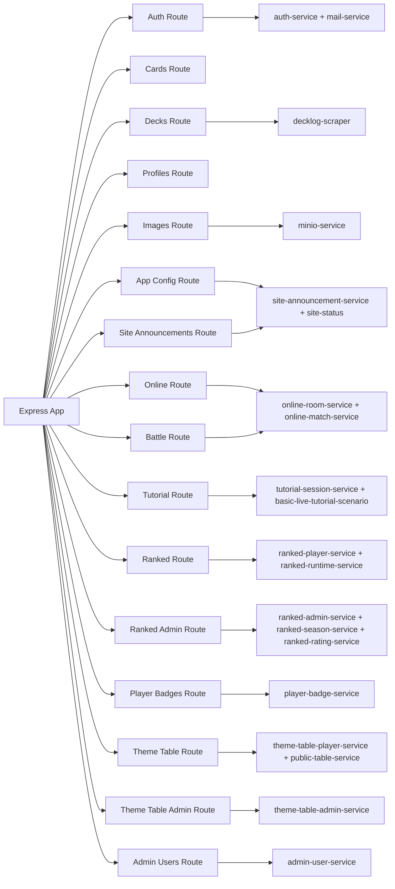
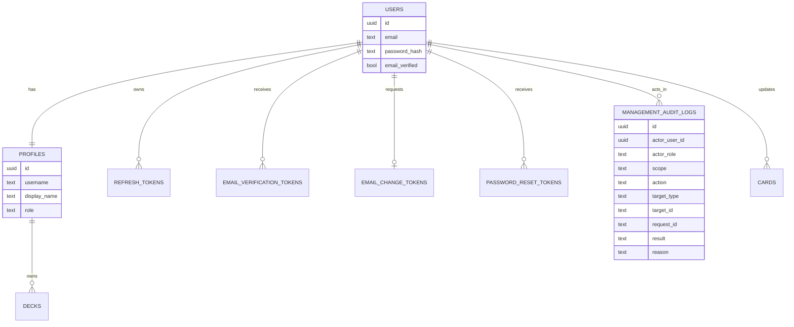
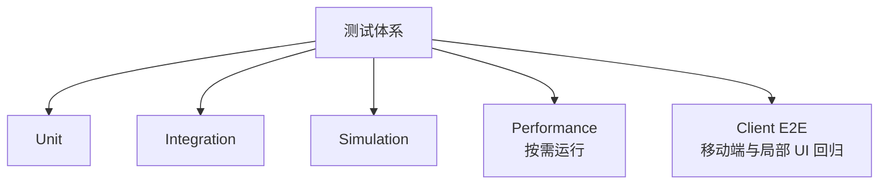

# Loveca 游戏系统设计文档

> 文档类型：设计文档  
> 适用范围：Loveca 当前代码架构与关键流程设计（基于现状实现）  
> 当前状态：现行系统设计；字段级 schema 以 `src/server/db/schema.ts` 和 `drizzle/` 增量迁移为准，初始化函数与触发器以 `docker/init.sql` 为准
> 最后更新：2026-09-07

---

## 1. 设计目标与范围

本文档用于描述 Loveca 的系统设计方案，重点覆盖：

- 对局引擎分层与状态机设计
- 规则处理与动作执行链路
- 前后端边界与数据流
- 持久化与资源服务设计
- 已实现功能对应的代码路径

运行时数据结构、算法链路、卡效/LIVE/recorder 热路径和跨模块不变量的横向说明，见 [运行时数据结构与算法链路](runtime-data-flow-and-algorithm-chain.md)。本文档维护系统全景和模块职责，不重复维护逐条运行时链路。

不包含内容：

- 具体实现代码
- 逐行算法说明
- 逐条运行时数据结构关系和热路径分析
- 历史旧版 OOP 伪模型

---

## 2. 总体架构设计

设计原则：

- 对局规则与 UI 展示解耦
- 阶段规则配置化，减少硬编码
- 动作处理器按职责拆分，便于扩展
- 本地离线可运行，在线能力通过 API 增强

---

## 3. 对局引擎分层设计

### 3.1 会话层

职责：

- 维护权威状态
- 接收并派发玩家动作
- 处理自动推进与规则自动化策略差异（`GameMode.DEBUG` / `GameMode.SOLITAIRE`）；正式联机由服务端房间/对局服务持有会话并通过座位映射驱动同一个 `GameSession`
- 提供玩家视角状态读取接口；联机快照通过 `PlayerViewState` 投影输出，不直接暴露权威状态

代码路径：

- `src/application/game-session.ts`
- `src/online/projector.ts`
- `src/online/visibility.ts`

### 3.2 应用服务层

职责：

- 初始化对局
- 统一动作执行与结果返回
- 驱动阶段流转
- 触发检查时机与规则处理

代码路径：

- `src/application/game-service.ts`

### 3.3 阶段配置层

职责：

- 统一定义主阶段行为、转换条件、自动动作
- 统一定义子阶段顺序与是否需要用户操作
- 提供活跃玩家判定策略

代码路径：

- `src/shared/phase-config/phase-registry.ts`
- `src/shared/phase-config/sub-phase-registry.ts`
- `src/shared/phase-config/active-player.ts`
- `src/application/phase-manager.ts`

### 3.4 动作处理层

职责：

- 按动作类型分发处理器
- 落地卡牌移动、子阶段确认、分数确认、撤销、应援等动作
- 统一动作成功/失败结果语义

代码路径：

- `src/application/action-handlers/index.ts`
- `src/application/action-handlers/play-member.handler.ts`
- `src/application/action-handlers/live-set.handler.ts`
- `src/application/action-handlers/mulligan.handler.ts`
- `src/application/action-handlers/tap-member.handler.ts`
- `src/application/action-handlers/phase-ten.handler.ts`
- `src/application/action-handlers/zone-operations.ts`
- `src/application/actions.ts`

### 3.5 规则层

职责：

- 处理规则动作（刷新、胜利检测、非法状态清理）
- 提供 Live/Heart 相关领域计算能力
- 提供费用与卡组校验能力

当前实现说明：

- 运行时主链路中的检查时机由 `GameService.executeCheckTiming()` 直接驱动 `rule-actions`
- `src/domain/rules/check-timing.ts` 保留了更完整的检查时机/自动能力处理模型，但当前未接入主流程
- `src/domain/rules/live-resolver.ts` 目前主要作为领域计算模块与测试覆盖对象，未作为对局主链路唯一入口

代码路径：

- `src/domain/rules/live-resolver.ts`
- `src/domain/rules/rule-actions.ts`
- `src/domain/rules/check-timing.ts`
- `src/domain/rules/cost-calculator.ts`
- `src/domain/rules/deck-validator.ts`
- `src/domain/value-objects/heart.ts`

### 3.6 领域实体层

职责：

- 承载对局状态结构与不可变更新语义
- 管理玩家、区域、卡牌实例与历史记录

代码路径：

- `src/domain/entities/game.ts`
- `src/domain/entities/player.ts`
- `src/domain/entities/zone.ts`
- `src/domain/entities/card.ts`

---

## 4. 对局流程状态机设计

子阶段设计原则：

- 主阶段下沉到可观察子阶段，支持 UI 精细控制
- 子阶段标注是否需要玩家确认
- 自动子阶段用于抽牌、推进与清理
- Live 成功效果在双方表演完成后依次处理，顺序为先攻成功效果、后攻成功效果，再进入分数确认与结算

代码路径：

- `src/shared/types/enums.ts`
- `src/shared/phase-config/sub-phase-registry.ts`

---

## 5. 动作执行链路设计

关键设计点：

- 动作是唯一状态入口，避免绕过规则层改状态
- 规则处理在动作后统一执行，保障状态一致性
- 会话层负责自动推进，不把流程控制分散到组件层

代码路径：

- `client/src/store/gameStore.ts`
- `src/application/game-session.ts`
- `src/application/game-service.ts`
- `src/application/action-handlers/`

---

## 6. 规则校正与操作模式设计

设计说明：

- 新对局默认 `RULES`，玩家输入先经过中央命令政策，只允许当前阶段、pending 和卡效流程明确开放的语义化命令
- `FREE` 在安全时点显式开启，保留己方区域的兼容移动与人工规则处理；正式联机开启需要对方同意，任意一方可单方恢复 `RULES`
- 系统规则处理负责客观状态纠偏，但不以“先接受非法命令、再自动清理”替代命令入口校验
- 胜利检测由规则层统一处理
- 已登记卡效进入自动能力队列；未登记或未接线卡效需要人工处理时，应先进入 `FREE`

代码路径：

- `src/application/manual-operation-mode.ts`（权威模式读取、切换安全点与命令重写）
- `src/application/player-command-policy.ts`（`RULES` / `FREE` 中央玩家命令政策）
- `src/application/game-session.ts`（权威状态、命令校验与模式切换）
- `src/application/game-service.ts`
- `src/domain/rules/rule-actions.ts`
- `src/domain/rules/check-timing.ts`（当前为未接线的完整模型实现）
- `src/online/projector.ts`（玩家视图、权限与模式投影）
- `src/server/services/online-match-service.ts`（正式联机协商、席位校验与服务端权威执行）
- `src/server/services/replay-payload-serialization.ts`（历史 authority checkpoint 的窄复水兼容边界）

---

## 7. 前端架构设计

职责划分：

- `gameStore`：对局状态桥接与动作封装
- `deckStore`：卡组编辑、浏览器本地卡组持久化与云端卡组管理；云端列表按登录用户隔离当前会话快照，以 30 秒 freshness 区分 `ensureCloudDecks` 的按需读取和 `refreshCloudDecks` 的强制确认读取，同用户并发请求共享同一 Promise，后台刷新失败时继续保留旧快照
- `authStore`：认证、会话恢复、个人资料与凭据更新、离线模式
- `rankedStore`：赛季总览与跨页面排位候场、确认和取消状态
- `themeTableStore`：主题活动总览与跨页面候场、确认、分配和开局前恢复状态
- `tutorialStore`：只在当前页面生命周期内持有教程访问令牌、玩家投影和公开命令回执，并通过 `remoteMatchClient` 把教程会话接入共享 `gameStore` 桌面；现有本地或远程对局占用会阻止教程接管牌桌
- `MatchmakingAudioLayer`：统一订阅公共牌桌、赛季排位和娱乐模式候场状态；只在实际进入候场时通过 `client/src/lib/matchmakingBgmClient.ts` 刷新公共曲库，离开候场不会重复读取，并由 `MatchmakingAudioPlayer` 从用户当前有效子集随机循环一首等待音乐，形成配对后按预留身份只播放一次独立提示音。`src/server/services/matchmaking-bgm-service.ts` 与 `src/server/routes/matchmaking-bgm.ts` 管理曲库、平台默认子集及内容寻址的公共 MP3；对象沿用 `/images/` 公共资源链路读取，`src/server/routes/images.ts` 同步提供受限开发 fallback。管理页支持多文件队列、逐项上传进度与失败项重试，队列在客户端逐个调用单文件上传接口；曲库卡片提供原生音频试听，平台默认子集独立保存。管理员上传在进入内存解析前按用户与来源地址限制尝试次数，解析后再限制窗口累计字节；服务层跳过合法 ID3v2 标签后要求至少两个连续且参数一致的 MPEG 音频帧，不再只按文件头接受内容。`profiles.matchmaking_bgm_track_ids` 为 `NULL` 时实时跟随平台默认值，非空数组保存用户自选集合，空数组表示候场静音；播放时始终与当前曲库取交集。音频在用户加入候场的操作中主动启动，以满足浏览器播放授权；自动播放、曲库读取或音频加载失败都不改变候场、确认或进房状态。账户中心继续分别保存候场背景音乐与匹配成功提示音开关，`authStore` 的当前 profile 将开关和曲目偏好注入该层
- `UpdateCoordinator`：在应用渲染后统一接收 `version.json` 与 prompt 型 Service Worker 的更新信号；版本发现只产生非阻断提示，进行中的本地/远程对局不提供更新入口，玩家在安全页面确认后才激活 waiting worker 并执行单次刷新
- 公开法律页：`App.tsx` 在认证与卡牌数据门禁之外识别 `/legal/disclaimer`、`/legal/takedown` 和 `/legal/privacy`；法律页作为应用壳的同步模块直接可用，普通同窗口链接通过 History API 切换并保留前进/后退，直达 URL 与修饰键/新标签页继续使用原生链接语义；法律声明和入口只由公开首页与登录后的大厅首页渲染，`ProductFrame` 不默认注入，运营管理、赛季、排位、观战、历史、法律文件及其他内页均不显示该页脚
- `GameBoard`：拖拽与对局主交互容器
- `TutorialPage` / `TutorialBattleSurface`：组合共享牌桌、公开步骤控制器和独立聚焦层；聚焦层只读取稳定语义锚点与当前玩家可见对象，不直接提交或模拟规则结果

代码路径：

- `client/src/store/gameStore.ts`
- `client/src/store/deckStore.ts`
- `client/src/store/authStore.ts`
- `client/src/store/rankedStore.ts`
- `client/src/store/themeTableStore.ts`
- `client/src/store/tutorialStore.ts`
- `client/src/lib/matchmakingAudio.ts`
- `client/src/components/matchmaking/MatchmakingAudioLayer.tsx`
- `client/src/lib/appUpdateCoordinator.ts`
- `client/src/lib/appUpdateRegistration.ts`
- `client/src/lib/legalPages.ts`
- `client/src/components/common/AppUpdateNotice.tsx`
- `client/src/components/common/LegalNotice.tsx`
- `client/src/components/pages/LegalPage.tsx`
- `client/src/components/pages/ThemeTablePage.tsx`
- `client/src/components/pages/TutorialPage.tsx`
- `client/src/components/tutorial/`
- `client/src/lib/tutorialScenario.ts`
- `client/src/components/theme-table/ThemeTableGlobalLayer.tsx`
- `client/src/components/pages/AccountCenterPage.tsx`
- `client/src/components/game/`
- `client/src/components/pages/GameSetupPage.tsx`

---

## 8. 服务端与数据设计

### 8.1 API 模块设计

代码路径：

- `src/server/app.ts`
- `src/server/routes/auth.ts`
- `src/server/routes/cards.ts`
- `src/server/routes/decks.ts`
- `src/server/routes/profiles.ts`
- `src/server/routes/images.ts`
- `src/server/routes/app-config.ts`
- `src/server/routes/match-emotes.ts`
- `src/server/routes/ai-effect-extraction.ts`
- `src/server/routes/site-announcements.ts`
- `src/server/routes/online.ts`
- `src/server/routes/battle.ts`
- `src/server/routes/tutorial.ts`
- `src/server/routes/ranked.ts`
- `src/server/routes/ranked-admin.ts`
- `src/server/routes/player-badges.ts`
- `src/server/routes/theme-table.ts`
- `src/server/routes/theme-table-admin.ts`
- `src/server/routes/admin-users.ts`
- `src/server/routes/platform-operations.ts`
- `src/server/site-status.ts`
- `src/server/services/site-announcement-service.ts`
- `src/server/services/admin-user-service.ts`
- `src/server/services/platform-operations-service.ts`
- `src/server/services/replay-retention.ts`
- `src/server/middleware/require-permission.ts`
- `src/server/middleware/require-gameplay-available.ts`
- `src/server/services/`
- `src/server/services/tutorial-session-service.ts`
- `src/server/services/basic-live-tutorial-scenario.ts`

认证与会话链路：

- 访问令牌固定使用带 issuer、audience、subject 与角色约束的 HS256 JWT；浏览器只在内存中保存访问令牌。
- 账号角色固定为 `user / season_admin / admin`，共享 permission 允许列表位于 `src/shared/auth/permissions.ts`。排位、主题赛季和赛季入口使用各自的赛季权限；平台、卡牌、构筑规则和用户管理使用独立权限，只有平台管理员拥有完整集合。
- 特权中间件先校验令牌角色，再读取 `profiles.role` 复核当前授权。角色不一致时返回稳定的 `AUTHORIZATION_STALE`，前端清除内存令牌并返回登录页；权限提升也必须通过新会话取得包含新角色的令牌。
- 刷新令牌通过 HttpOnly Cookie 传递，Cookie 保存令牌定位符与随机 secret，数据库只保存 secret 预哈希后的 bcrypt 摘要；刷新和当前设备登出分别在数据库事务中锁定、校验并轮换或撤销目标令牌。
- 平台管理员通过独立用户管理服务分页读取账号摘要，并在角色下拉菜单中直接修改角色。角色变更事务锁定平台管理员集合与目标账号，使用 `expectedRole` 防止并发覆盖，阻止最后一个平台管理员被降级，并在同一事务内撤销目标全部刷新令牌；角色修改不要求原因，也不写入持久审计。
- 启用 `EMAIL_ENABLED` 后，注册邮箱和登录前验证成为强制门禁，服务启动时校验完整 SMTP 配置。邮箱验证、密码重置与邮箱换绑只保存带密钥摘要；邮箱换绑先校验当前密码并向新邮箱发送一次性链接，确认时在同一事务中更新邮箱、撤销刷新令牌并清理其他认证 token。邮件链接通过 URL fragment 交给前端并在页面初始化时清理。
- 认证端点统一返回不可缓存响应，并使用按 IP 与账号标识组合的有界限流。认证和图片/BGM 上传限流均使用 API 进程内的内存桶，重启后清空，不跨实例共享；多实例部署前需提供共享限流或可信代理的等价限制。
- 修改或重置密码、确认邮箱换绑会撤销刷新令牌，但已签发访问令牌没有服务端黑名单，仍可使用到自然过期（默认 15 分钟）；特权请求继续执行当前角色复核。
- 客户端在支持 Web Locks 时跨标签页串行刷新令牌；不支持时只保证单标签页内的并发去重。边界由 `client/src/lib/apiClient.ts` 承担。
- 运行时只接受 v2 刷新 Cookie 和一次性 token 格式；维护窗口中的认证切换将可识别的旧 bcrypt 密码封装成显式兼容状态，成功登录后原子升级为当前 v2 预哈希格式。原始旧 Cookie 和一次性 token 统一失效；已标记重置或未知密码格式会阻断迁移，不以运行时兜底伪装为可登录账号。

密码兼容路径目前接受 `$loveca-bcrypt-raw$` 包装格式，登录成功后升级为 `$loveca-bcrypt-sha256$` 并撤销旧会话，不直接接受裸旧 bcrypt。这是与 `AGENTS.md` 禁止运行时懒迁移原则的已确认偏差，不构成新增兼容例外的依据；待修事项由 `PROJECT_PROGRESS_TODO.md` 跟踪，既有转换行为见 `drizzle/migration-notes/auth-v1-to-v2-credential-cutover.md`。

认证关键代码路径：

- `src/server/config.ts`
- `src/server/middleware/authenticate.ts`
- `src/server/middleware/require-permission.ts`
- `src/server/middleware/auth-rate-limit.ts`
- `src/server/routes/auth.ts`
- `src/server/routes/admin-users.ts`
- `src/server/services/auth-service.ts`
- `src/server/services/admin-user-service.ts`
- `src/shared/auth/permissions.ts`
- `src/server/services/mail-service.ts`
- `client/src/lib/apiClient.ts`
- `client/src/store/authStore.ts`
- `client/src/components/pages/AccountCenterPage.tsx`
- `drizzle/data-migrations/auth-v1-to-v2-credential-cutover.ts`

### 8.2 数据模型设计

字段级数据库定义不在本文档重复维护；当前代码侧 schema 见 `src/server/db/schema.ts`，物理变更顺序见 `drizzle/` 增量迁移，基础初始化结构和数据库函数/触发器见 `docker/init.sql`。新库必须先执行初始化脚本，再执行全部增量迁移。

赛季排位在公共牌桌的持久票据/预留状态机上增加独立 `RANKED` 队列上下文，并以赛季、
排位对局、追加式评分事件、物化步骤、当前积分投影和跨赛季种子组成可审计结算模型。
候场与配对按赛季冻结的竞技环境隔离；权威对局封存后由评分服务幂等结算，迟到结果或
管理员更正按稳定顺序重建派生投影。字段、事务和更正链细节见
[赛季排位数据与结算设计](matchmaking-and-ladder/RANKED_R2_DATA_AND_SETTLEMENT_DESIGN.md)。

玩家徽章以持久规则和幂等授予记录分离活动配置、资格来源与玩家所有权。排位赛季和娱乐
模式活动各自最多配置一枚徽章；赛季管理员上传图片后建立该活动的 3 场资格规则，上传当下
会在同一事务补发已达标玩家，之后分别在评分结算与娱乐模式权威对局封存事务中继续幂等
授予。图片替换只切换活动规则的不可变对象引用，不新建授予记录；个人中心只通过本人端点
读取。首届排位既有静态图片在停机迁移中上传对象存储，运行时不再读取仓库静态目录。

轮换主题牌桌在同一持久票据/预留状态机上增加独立 `THEME` 队列与活动环境身份。网站与管理界面统一把该玩法呈现为非计分“娱乐模式”，内部继续保留主题牌桌技术命名，并复用排位的周期、开放窗口、生命周期和管理页结构；管理员可将合法云端卡组或 YAML 复制为不可变服务端预组，并在未结束活动中继续新增、编辑或移出卡组。每副当前预组自动形成同卡组内战，并与池内既有卡组形成等权组合；编辑以退休旧预组、创建同 `deckKey` 新版本和重建未来组合实现，删除以退休版本和停用组合实现，不回写不可变分配记录或票据锁组。赛季管理员在草稿中配置 `X 选 1`；`X=1` 保持单击候场交互，`X>1` 时玩家端在独立选组弹层中展示由预留 ID 与启用对阵图确定性生成的候选，并通过卡组选择栏与完整卡册确认本局预组。候选不持久化、不建立曝光审计，服务端只校验最终选择仍可用并把预组版本锁入主题票据；入队要求活动处于 `ACTIVE`，最后一个可分配组合消失时在同一数据库语句中自动暂停新入队，双方确认后冻结选择、组合与锁组再创建房间，配置失效时冻结失败关闭并按无过错口径释放预留。玩家本期战绩与当前卡组版本的两两对阵胜负由 `theme_table_assignments` 关联 `match_records` 的权威终局实时聚合；对阵关系图以预组为节点、以两端着色连线和胜局比标签表达关系，按真实分配座位还原卡组胜负，不新增评分投影、结算流水或排行榜。自组对局不绘制为自环，平局计入完成局数，中断与损坏记录不计入，退休卡组版本不混入当前卡组池图。主题房间禁用原房再战，赛后返回娱乐模式入口重新候场，确保每局都有新的分配事实。开局前责任方离场或未到场时，恢复服务终结旧预留，并在活动仍开放时为无过错方创建保留原 `joinedAt` 与已选预组的新票据。详细边界见[轮换主题牌桌策划与设计](matchmaking-and-ladder/ROTATING_THEME_TABLE_DESIGN.md)。

`X 选 1` 的当前权威时序为“先匹配，后选组”：主题票据以未选组占位进入 FIFO 队列，预留形成后再以预留 ID 和启用对阵图确定性生成双方候选。`X=1` 直接走确认界面，`X>1` 使用独立选组弹层；刷新可重建同一候选。不建立 offer/history 表，最终选择写入现有票据卡组快照。

代码路径：

- `src/server/db/schema.ts`
- `src/server/db/drizzle.ts`
- `src/server/db/pool.ts`
- `src/server/services/ranked-season-service.ts`
- `src/server/services/ranked-player-service.ts`
- `src/server/services/ranked-rating-service.ts`
- `src/server/services/ranked-runtime-service.ts`
- `src/server/services/ranked-admin-service.ts`
- `src/server/services/ranked-v3-migration-service.ts`
- `src/server/services/player-badge-service.ts`
- `src/server/player-badges/award.ts`
- `src/server/services/theme-table-player-service.ts`
- `src/server/services/theme-table-admin-service.ts`
- `src/server/services/theme-table-allocation-service.ts`
- `src/server/services/theme-table-deck-choice.ts`
- `src/server/services/theme-table-recovery-service.ts`
- `src/server/rating/ranked-ledger.ts`
- `src/server/rating/glicko.ts`
- `scripts/migrate-ranked-season-v3.ts`
- `drizzle/0010_add_ranked_system.sql`
- `drizzle/0019_add_player_badges.sql`
- `drizzle/0026_add_theme_table_v1.sql`
- `drizzle/0036_add_theme_deck_choice.sql`

---

## 9. 测试设计与覆盖结构

代码路径：

- 单元与集成：`tests/unit/`、`tests/integration/`
- 流程仿真：`tests/simulation/`
- 性能基准：`tests/performance/`
- 前端 E2E：`client/tests/e2e/`，覆盖移动端、响应式布局、局部 UI 回归，以及排位玩家/管理员真实 API 流程；`client/test-results/` 或根目录 `test-results/` 仅为运行产物，不作为测试入口

---

## 10. 当前落地边界（设计视角）

### 10.1 已落地

- 配置化阶段/子阶段驱动的主流程
- 动作处理器体系与规则动作校正链路
- Live 结算主流程、手动判定确认与分数确认链路
- 四章新手教程：`TutorialSessionService` 使用真实 `GameSession`、确定性随机决策带和正式命令建立临时权威会话，HTTP transport 只返回教程玩家投影、公开对象绑定及本人命令回执；前端以 `TutorialBattleSurface` 复用共享牌桌，并由独立引导层处理步骤、聚焦、响应式和 reduced-motion。教程会话不写正式对局记录，进程内 TTL、访客限流与现有牌桌占用保护构成当前运行边界
- 本地双人调试模式与对墙打模式：`client/src/components/pages/GameSetupPage.tsx` 按快速匹配、活动对战和其他对战组织公共牌桌、赛季排位、娱乐模式、房间联机、对墙打和双人调试入口，并保留本地模式的分步选组；`client/src/lib/debugPerspective.ts` 与 `client/src/store/gameStore.ts` 在本地双人调试的 `RULES` 模式下按玩家视图权限自动跟随当前操作方，`client/src/components/game/GameBoard.tsx` 同时为桌面和移动端保留显式视角切换与确认式重开入口
- 认证、卡组、卡牌、图片管理 API
- 版本化 PT 限制表：`src/domain/rules/deck-point-table.ts` 定义显式规则快照，`src/server/services/deck-point-table-service.ts` 以 PostgreSQL 事务维护 `DRAFT / SCHEDULED / ACTIVE / RETIRED` 状态、revision 乐观锁和审计日志。定时版本以 `Asia/Shanghai` 解析精确到秒的本地时间；排期改到当前/过去、立即发布及 ACTIVE 废弃替换都在单事务中切换，且任何成功操作提交前强制校验有且仅有一张 ACTIVE 表。`/api/deck-point-tables/current` 仅暴露玩家校验所需字段，卡组保存和对局准入始终以服务端 ACTIVE 表为权威；`client/src/store/deckPointTableStore.ts` 只将内置的已确认表用作离线/启动失败展示回退。管理员通过 `DeckPointTablesAdminPage` 完成任意状态表的编辑、差异预览、发布、取消排期、废弃/替换、删除已退役表和历史复制。
- 平台状态、公告与玩家入口配置：`src/server/site-status.ts` 定义 `NORMAL / RESTRICTING_NEW_GAMES / MAINTENANCE` 三态公开契约，`src/server/services/site-announcement-service.ts` 以数据库为权威协调状态、公告与独立公开快照，`src/server/services/public-site-status-snapshot-service.ts` 将维护门禁原子写入前端版本目录之外的持久文件，`src/server/services/readiness-service.ts` 在恢复开放前检查数据库与必要表。`src/server/services/battle-timeout-config-service.ts` 在同一平台单例行维护玩家操作超时与断线重连期限；`src/server/routes/site-announcements.ts` 提供管理员状态、公告、入口和对战时限 API，`src/server/routes/app-config.ts` 通过 `/api/config` 暴露公开 `siteStatus`、`features.battleEntries` 与 `features.battleTimeouts`。新联机对局在 `src/server/services/online-room-service.ts` 开局时冻结当时配置，进行中对局继续使用自身快照；入口位只控制 `HomePage` 和 `GameSetupPage` 的导航发现，不改变赛季生命周期、队列运行态，也不卸载跨页面候场层。相关数据库增量由 `drizzle/0027_add_player_battle_entry_visibility.sql`、`drizzle/0029_maintenance_mode_three_state.sql` 与 `drizzle/0030_add_global_battle_timeout_config.sql` 提供
- 云端卡组与离线模式并存：已登录玩家使用服务端卡组记录；离线访客通过 `client/src/lib/localDeckStorage.ts` 把版本化 `LocalDeck` 列表保存到当前浏览器，并在 `DeckManager` / `DeckSelector` 中复用同一构筑校验与对局加载链路
- 正式联机房间闭环：创建/加入、云端卡组锁定、双方准备开始、开局猜拳与胜者决定先后手、服务端权威对局、轮询同步、请求式重开、主动认输、房间号只读观战、离开/短暂恢复与管理员房间观测。认输由 `GameSession` 以 `OPPONENT_SURRENDER` 结束权威对局，公开投影仅暴露终局原因与胜负席位，记录服务封存为 `SURRENDERED`；赛后离开会释放真人对局占用。普通玩家专用观战链接已完整移除。房间号观战默认开放双方玩家视角，观战会话可在当前已授权视角间切换；preferred 目标按玩家身份保存，授权 fallback 只改变 effective 目标。普通观战资格和会话绑定不可复用的房间代际，当前 match/席位只是可替换单局绑定：双方接受重开后返回结构化局间等待，新局创建后按原玩家身份重新解析席位并自动续看；房间关闭、等待期间参赛成员变化、会话过期或全部授权关闭会稳定终止旧资格。同一房间最多 10 个活跃普通观战会话，等待会话继续占名额，管理员单局观战不占公开名额且不跨局；恢复会话、快照、公开日志与视角切换共享服务端请求限流。普通观战采用请求完成后再计时的串行轮询与会话级退避，频率保护或短暂网络中断时保留最后有效桌面并自动恢复；跨局时以房间/绑定代际隔离响应，客户端等待时清空旧单局 store 与日志，新局完整投影到达后再建立桌面
- 单局文字与快捷表情通信：`src/online/chat-types.ts` 以 `TEXT | EMOTE` 判别联合维护共享条目契约和表情资源快照；`src/server/services/match-emote-catalog-service.ts` 通过数据库不可变版本和 active pointer 管理 1–12 项运营目录，重编码后的内容寻址 WebP 由对象存储提供，管理员可在 `MatchEmotesAdminPage` 排序、改名、停用和替换资源，`/api/config` 公开当前启用目录。`src/server/services/online-match-chat-runtime.ts` 维护按 `matchId` 隔离的有界内存消息、幂等标识、游标分页、文本校验、综合限频和表情冷却；新表情发送直接校验目录版本与启用状态并固化资源快照。`src/server/services/online-match-service.ts` 复用参与者身份与观战会话/代际授权，`src/server/services/online-room-service.ts` 阻止已退出成员被迟到轮询重新激活，`src/server/routes/online.ts` 提供当前房间成员读写和观战只读 REST 入口。前端由 `client/src/components/game/MatchChat.tsx` 独立轮询并渲染共同时间流，`client/src/components/game/MatchEmoteVisual.tsx` 按 reduced-motion、页面可见性与视口状态选择静态或动画资源，`GameBoard` / `PlayerArea` 只声明席位身份锚点。目录与资源元数据持久化；局内消息不写入 `GameState`、公共事件、历史记录或回放，重开、双方离开销毁旧对局运行态或 API 服务重启后不恢复
- 运营角色与管理中心开发基线：`src/shared/auth/permissions.ts` 定义 `user / season_admin / admin` 和显式权限矩阵，`src/server/middleware/require-permission.ts` 为特权请求复核数据库当前角色。`client/src/components/admin/AdminCenterPage.tsx` 按权限投影平台运营中心或赛季运营中心，平台管理员可通过 `client/src/components/admin/UserAdminPage.tsx` 分页检索账号，并在角色下拉菜单中直接保存变更。赛季管理员复用平台管理员历史页查看全部历史记录及双方玩家视角的只读回放，列表可按排位赛季或娱乐模式活动筛选，但原始回放包导出继续要求 `platform.manage`。`src/server/services/admin-user-service.ts` 负责角色并发保护、最后管理员保护和刷新令牌撤销；角色修改不要求原因或持久审计。数据库增量由 `drizzle/0028_add_season_admin_role.sql` 提供赛季管理审计表骨架。排位、主题赛季和入口权限已经下放，但全部赛季写操作持久审计、破坏性操作原因与完整 E2E 尚未完成，因此当前不得向真实运营账号分配 `season_admin`
- AI 私密配置：`src/server/services/ai-effect-extraction-service.ts` 以 PostgreSQL 单例和 revision 事务审计保存运行时配置，使用部署主密钥加密 API Key，并在每次候选测试或提取时执行上游允许列表、DNS 私网阻断、HTTPS、禁重定向、超时、大小、并发和管理员级限频。浏览器只向 `/api/ai-effect-extraction/admin/extract` 提交 `cardCode`，服务端读取 `cards` 与 MinIO 卡图，返回文本只进入 `CardEditModal` 待确认状态；旧 Vite DashScope 代理已经移除
- 公共牌桌 Beta：`src/server/services/public-table-service.ts` 以 PostgreSQL 候场票据和配对预留实现 FIFO 候场、双方确认、锁定卡组快照与超时清理；房间创建使用带代际校验的短租约和有限重试，旧创建者不能覆盖接管后的房间。`src/server/services/gameplay-participation-service.ts` 约束用户不能同时处于候场、房间或对局；确认成功后由 `src/server/services/online-room-service.ts` 创建封闭的公共牌桌房间，双方需在 60 秒内到场才进入猜拳，超时则结束本次开局，并复用正式联机认输、观战和记录链路。`client/src/components/public-table/PublicTableGlobalLayer.tsx` 和 `client/src/components/pages/PublicTablePage.tsx` 负责跨页面候场状态、确认及单次自动进入房间，持久化 schema 由 `src/server/db/schema.ts` 与 `drizzle/0008_add_public_table_beta.sql`、`drizzle/0010_add_ranked_system.sql` 对齐
- 赛季排位首版：`src/server/services/public-table-service.ts` 复用票据/预留状态机并以 `queueKind + seasonId + competitiveEnvironmentId` 隔离休闲与排位候场；`src/server/services/online-room-service.ts` 按房间代际去重开局并补偿预留、赛季、占用和票据绑定，断线裁定以持久状态和在线代际共同防止重连竞态。`src/server/services/ranked-player-service.ts` 提供赛季总览、固定窗口准入、个人战绩和排行榜，`src/server/services/ranked-rating-service.ts`、`src/server/rating/ranked-rating.ts` 与 `src/server/rating/ranked-ledger.ts` 负责权威结果幂等结算、版本化积分调度、迟到结果重建和追加式更正，`src/server/services/ranked-runtime-service.ts` 先排空可靠结算，再终止到期运行态并执行平台无结果收口。前端由 `client/src/store/rankedStore.ts`、`client/src/components/pages/RankedPage.tsx` 和 `client/src/components/ranked/RankedGlobalLayer.tsx` 提供跨页面候场闭环；管理员由 `client/src/components/admin/RankedAdminPage.tsx` 管理赛季及纯文本公告、查看候场/运行/结算健康与赛季经营分布、按用户查询当前评分、RD、场数与独立定级/参榜进度，并在排名上下文表中为目标及上下各最多 3 名逐行展示胜负与当前 `ACTIVE` 发布口径下的最常用卡组分类、按状态分页检索排位对局并核对双方加减分，以及执行带签名预览的异常结算和参数回算，聚合读取由 `src/server/services/ranked-admin-service.ts` 提供。玩家上下文以单条 SQL 读取当前 `ledgerRevision`、榜单窗口中每名玩家的有效排位结果与当前分类发布/assignment，在 API 层分别聚合胜负与最常用分类，不创建额外排名、胜负或最常用投影副本。排位基线、评分修订和赛季公告数据库结构分别由 `drizzle/0010_add_ranked_system.sql`、`drizzle/0017_add_ranked_rating_revisions.sql`、`drizzle/0018_add_ranked_season_announcement.sql` 提供。名为 V1 的首个生产赛季当前使用 `GLICKO1_PER_MATCH_V3`；未来新赛季默认 V4，使用 `ratingScale=800 / minimumRD=100 / 5 场定级 / 1800 中心成长池`，详见 [V4 评分设计](matchmaking-and-ladder/RANKED_V4_RATING_DESIGN.md)。V2→V3 停机迁移文档保留为历史运维与审计资料
- 排位单方操作超时：`src/online/ranked-stall.ts` 从权威 `GameState` 识别当前唯一责任玩家和稳定等待键；`src/server/services/online-match-service.ts` 按对局冻结的 `battleTimeouts` 维护不进入 checkpoint/回放的窗口开始时间、截止时间与代际，只有责任玩家成功命令才复位；`src/server/services/online-room-service.ts` 复用排位持久裁定权并在数据库等待后复核等待键、责任玩家、代际和截止时间，再执行权威判负。玩家快照只增加责任席位、窗口开始时间、截止时间和终局判负原因，`client/src/components/game/RankedStallNotice.tsx` 最多在最后 1 分钟提供非阻塞提示；非排位、观战和历史回放不启用该计时
- 轮换主题牌桌第一版：`src/server/services/theme-table-admin-service.ts` 冻结主题赛季和服务端预组，支持未结束赛季的云端卡组/YAML 加入、版本化编辑和移出卡组池，并自动生成同卡组内战及不同当前预组间的等权组合；旧预组通过 `retired_at` 留存供既有分配审计。`src/server/services/theme-table-deck-choice.ts` 按预留 ID 与启用组合图确定性生成双方候选，`src/server/services/theme-table-player-service.ts` 在确认时校验最终选择并把预组快照锁入票据，按主题分配与权威终局聚合本人胜负，不建立主题积分或榜单。`src/server/services/theme-table-allocation-service.ts` 在双方确认后的事务内冻结与双方锁定卡组对应的启用组合和分配记录，`src/server/services/theme-table-recovery-service.ts` 处理开局前责任方离场或未到场后的无过错回队。玩家入口由 `client/src/store/themeTableStore.ts`、`client/src/components/pages/ThemeTablePage.tsx`、`client/src/components/theme-table/ThemeTableGlobalLayer.tsx` 与 `X 选 1` 选组弹层 `client/src/components/theme-table/ThemeDeckChoiceDialog.tsx` 提供；卡组池使用响应式卡图卡册并复用 `CardDetailDrawer`，抽屉统一通过 `useDialogAccessibility` 约束焦点、关闭和滚动。管理员界面复用 `AdminPageHeader`、`AdminViewTabs`、`SeasonOpenWindowsFields` 和共享 `CardEditor`，主页面位于 `client/src/components/admin/ThemeTableAdminPage.tsx`。数据库结构由 `drizzle/0026_add_theme_table_v1.sql` 与 `drizzle/0036_add_theme_deck_choice.sql` 提供；当前仅为开发/内测基线
- 赛季环境卡牌与卡组统计：`src/server/services/ranked-deck-observation-service.ts` 在排位注册的可串行化事务中原子保存双方主卡组最小事实，以基础卡号合并罕度并生成稳定构筑指纹；`src/server/services/ranked-environment-service.ts` 只聚合最终 `SETTLED` 且两席事实完整的对局，目标接口在不读取卡组分类发布/assignment 的前提下，为使用占比、胜者构成和高排名玩家三个 TAB 各自独立计算 Top 30。使用占比和胜者构成支持卡牌板块自身的玩家等权/对局等权设置，高排名玩家固定先归一化每名玩家后再玩家等权；胜者构成表达胜方卡组包含了哪些卡，不是卡牌胜率。其上的 `deck-classifier-engine / release / admin-service / worker` 以人工覆盖、精确样板、严格规则、加权相似度的顺序生成版本化派生结果，新发布只有全量成功才原子替换旧 `ACTIVE`；`ranked-deck-archetype-environment-service.ts` 通过 `/api/ranked/environment/decks` 提供玩家等权、对局等权、胜者构成、胜率、非镜像胜率及当前排行榜前 N 名玩家的等权赛季卡组构成。单例展示设置为卡组与卡牌分别保存展示内容/基础计权，只共享 N；任一板块全部关闭时只在自身聚合前返回空结果。`client/src/components/pages/RankedPage.tsx` 分别按两组启用内容展示最多三个 TAB、样本量、覆盖率和明细表格；管理员可从排位对局详情将同一长期事实直接导入分类样板。长期事实由 `drizzle/0020_add_ranked_deck_observations.sql` 提供，开发分支分类结构最终由单一 `0032_add_deck_classifier.sql` 提供；能量卡组与逐张实例不属于长期事实。详见[赛季排位卡组分类与环境饼图](matchmaking-and-ladder/RANKED_DECK_CLASSIFIER.md)
- 活动徽章：`src/server/services/activity-badge-service.ts`、`src/server/routes/activity-badges.ts` 与 `drizzle/0035_add_activity_badges.sql` 让赛季管理员按排位赛季／娱乐模式活动上传和替换徽章，并以 revision、幂等指纹、公开不可变对象和管理审计原子切换当前图。`src/server/player-badges/award.ts` 在排位评分事务、娱乐模式对局封存事务及首次上传补发中，按活动的 3 场规则幂等授予并固定资格对局证据；图片替换不重复授予。`src/server/services/player-badge-service.ts` 与 `/api/player-badges/me` 只提供本人读取，`client/src/components/player-badges/BadgeShelf.tsx` 在个人中心展示；首届静态图迁移见 `drizzle/migration-notes/activity-badges.md`
- 玩家游戏桌壁纸：`src/server/services/player-wallpaper-service.ts`、`src/server/routes/player-wallpapers.ts` 与 `drizzle/0024_add_player_wallpapers.sql` 在独立私有 MinIO bucket 和 PostgreSQL 中维护本人壁纸、北京时间每日发布额度、幂等结果与管理员移除审计；`client/src/store/playerWallpaperStore.ts` 只在当前账号会话内加载鉴权 Blob，`client/src/components/game/BoardBackground.tsx` 为个人中心预览和所有共享 `GameBoard` 提供同一背景层。壁纸不进入权威对局、玩家投影、checkpoint、历史或回放；详细边界见[玩家游戏桌壁纸设计](player-wallpaper/design.md)
- 赛季活动大封面：`src/server/services/activity-cover-service.ts` 与 `drizzle/0034_add_activity_covers.sql` 以 `activityType + activityId` 保存排位／娱乐模式的单行当前配置、revision、最后一次幂等和公共不可变对象引用；发布先写入规范化母图及宽屏／紧凑成品，再在同一 PostgreSQL 事务中切换引用并写入 `management_audit_logs`。`src/server/services/static-image-processing-service.ts` 为活动封面与玩家壁纸提供无业务归属的图片校验、规范化、裁切和共享处理并发底座；`src/server/routes/activity-covers.ts` 按活动类型复核当前权限。玩家主投影只返回当前布局资源与显示参数，`client/src/components/activity-cover/ActivityCoverHero.tsx` 负责响应式切槽和默认视觉降级，管理页共用 `ActivityCoverEditor.tsx`。封面不进入赛季竞技环境、候场、房间、对局、历史或回放；孤立对象扫描、真实对象存储集成和完整视觉／E2E 仍是生产上线前边界，详见[活动大封面需求与设计](matchmaking-and-ladder/SEASON_ACTIVITY_COVER_REQUIREMENTS_AND_DESIGN.md)
- 赛季内评分参数修订：`src/server/services/ranked-rating-revision-service.ts` 以受限白名单从 V3/V4 当前冻结 config 构造唯一新修订，签名 dry-run 绑定 config 哈希、流水 revision、原因和操作人；应用在暂停排位且运行态/冻结环境校验通过后，以可串行化事务追加每场最新指令、重建玩家投影和单局 before/after 快照，并将完整新旧 config 与预览摘要保存在 `ranked_rating_revisions`。详见[参数修订与全量回算](matchmaking-and-ladder/RANKED_RATING_PARAMETER_REVISION.md)。
- 维护期间新对局限制：`src/server/middleware/require-gameplay-available.ts` 会在维护或限制新开局状态下拦截新建/加入房间、准备开局、开局流程、重开接受和服务端对墙打创建/重开；进行中对局的快照、命令、观战、回放和离开入口不被主动中断
- 服务端可记录对墙打：`src/server/services/solitaire-match-service.ts` 复用 recorded match 链路创建 `GameMode.SOLITAIRE` 权威对局，并在重开时封存旧局、沿用锁定卡组快照创建新的 `matchId`；`client/src/lib/solitaireMatchRecovery.ts` 在同一浏览器标签页保存当前对墙打 matchId 并在刷新或重开后同步恢复目标，`src/server/services/solitaire-runtime-recovery-service.ts` 可在运行态缺失时从最新 authority checkpoint 和公共事件尾部恢复运行中对墙打，`src/server/routes/battle.ts` 提供对墙打创建、重开、运行中快照/命令/推进/离开、公共事件增量读取，以及中性历史读取入口
- 面向联机的 `PlayerViewState` 脱敏投影、可见性策略和命令权限投影
- 运行中对局公共日志：`src/application/game-session.ts` 维护 `PublicEvent` 序列；正式联机 `/api/online/matches/:matchId/public-events`、正式联机观战 `/api/online/spectator-links/:token/public-events` 与对墙打 `/api/battle/solitaire-matches/:matchId/public-events` 按 `afterSeq` 返回公共事件增量，单次响应受 `ONLINE_PUBLIC_EVENTS_MAX_BATCH` 保护并在截断时返回 `truncated/droppedEventCount`，运行中 snapshot 继续只承载当前玩家视图，并以 `currentPublicSeq` 暴露公共日志增量水位。权威状态提交产生的公开 `HAND -> WAITING_ROOM` 移动可携带同席位共享的 `movementBatchId`；前端以独立于规则状态和对局日志游标的临时队列，将公开牌面向实时双方固定展示 1180ms，连续批次串行播放且入队时立即遮挡目标实体，并在补拉、重复轮询、重连和撤销序号回退时分别处理合批、去重、跳过历史与重置；自客户端首次接收入队起等待超过 5 秒的批次会解除遮挡并丢弃，TTL 只使用客户端单调时钟，不与服务端事件时间戳相减。公共日志或弃牌播放泵更新不递增玩家视图动画 generation，避免取消已排程的普通飞牌。该展示不引入确认命令、持久化历史或规则等待，观战与历史回放不播放；教程因没有公共事件增量而保留玩家视图差分 fallback
- 对局记录与回放阶段性闭环：`src/server/services/match-recorder-service.ts` 写入历史根记录、卡组快照、timeline、authority checkpoint、public/private event 与部分 decision record；`src/server/services/match-replay-read-service.ts` 按参与者玩家视角读取正式联机与服务端可记录对墙打的历史列表、详情、timeline 与只读 checkpoint 投影；完整回放默认保留 10 天，`src/server/services/replay-retention.ts` 统一停机脚本与管理员页面使用的候选统计、排位观察阻断、批量行锁和元数据降级语义，`drizzle/data-migrations/purge-expired-match-replay-data.ts` 保留默认 dry-run 的停机入口。`src/server/services/platform-operations-service.ts`、`ranked-analysis-export.ts` 与 `client/src/components/admin/PlatformOperationsPage.tsx` 提供平台管理员预览、显式确认清理和赛季匿名原始分析 ZIP 下载；导出查询边界只包含 `ranked_*` 规范化事实，卡组来自长期 `ranked_deck_observations`，不触及 checkpoint、完整对局记录或回放数据。`client/src/components/pages/MatchRecordsPage.tsx` 可打开只读 `GameBoard` 回放节点，并为已清理记录只展示元信息

### 10.2 规划中

- WebSocket/SSE 等实时传输增强（当前正式联机使用短间隔 HTTP 轮询）
- 对局记录与回放后续增强：正式联机进程重启后恢复运行中对局、对墙打恢复后的更细粒度追赶、完整随机记录、完整决策覆盖、自由拖拽/手动处理原因结构化、确定性重演、逐命令动画、公开分享回放与长期兼容策略
- 更完整的自动能力编排与检查时机接线
- 更高覆盖的性能与稳定性专项测试
- V4 新赛季上线前的历史对局回放验证、外部告警渠道和跨日运营趋势
- 轮换主题牌桌的真实预组试打、完整组合指标与告警、进行中房间跨进程恢复、双浏览器验收和生产开放

---

## 11. 文档维护约定

- 本文档为“设计文档”，新增已实现模块时需补充对应代码路径
- 本文档维护系统全景、分层职责、状态机和模块入口；运行时数据结构关系、命令/卡效/LIVE/recorder 链路和跨模块不变量维护在 `docs/runtime-data-flow-and-algorithm-chain.md`
- 架构和流程图统一使用 Mermaid
- 需求变更先更新需求文档，再同步更新本设计文档
- 与外部系统强耦合时，需在相关模块文档中补充原始链接
