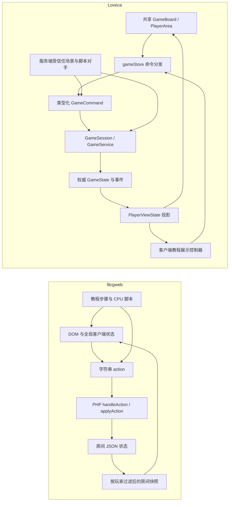
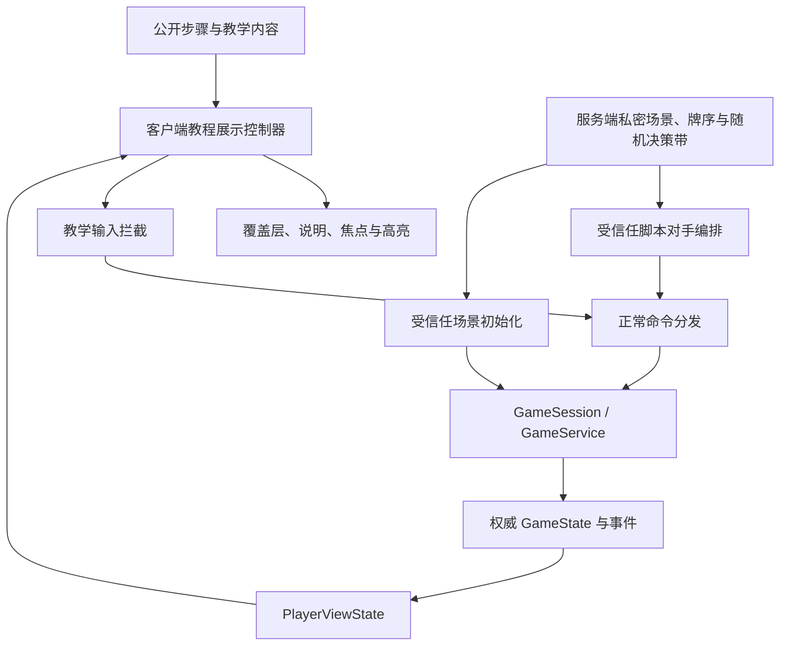

# lltcgweb 与 Loveca 对局模型对应关系

> 文档类型：专题说明
> 适用范围：`lltcgweb` 竞品对局模型、Loveca 权威对局模型、新手教程迁移边界
> 当前状态：2026-08-26 对应关系与四章教程实现基线；私密场景、产品入口和同局合法检查点已经接通，等待人工体验验收
> 对照基线：lltcgweb commit `a7e7da7fdf487a290341fdcd5936264ea9fe55bd`；Loveca 当前工作树
> 维护说明：本文维护两套对局模型的对应关系与可迁移边界；Loveca 当前架构事实仍以[系统设计](../system-design.md)和[运行时数据结构与算法链路](../runtime-data-flow-and-algorithm-chain.md)为准；教程产品范围由[新手引导教程需求](requirements.md)维护

## 1. 结论

lltcgweb 的新手教程可以迁移到 Loveca，但迁移对象应是“教学脚本、步骤目标、固定场景和引导节奏”，不是 PHP 对局状态、客户端全局状态或原有 DOM 控制代码。

两套模型在玩家、区域、阶段、基础动作和 LIVE 判定概念上能够逐项对应；主要差异在于：

- lltcgweb 以房间 JSON 和字符串动作驱动，教程可直接改写房间状态并依赖页面 DOM。
- Loveca 以 `GameSession`、类型化命令、权威事件和 `PlayerViewState` 驱动，教程必须通过正常命令推进，并继续遵守隐藏信息投影。
- lltcgweb 教程所需的固定牌序、固定先手、脚本对手和步骤拦截，已在 Loveca 中形成不写正式对局记录的服务端运行时、私密卡组、完整脚本序列和产品 transport；Loveca 的真实换牌仍会再次洗牌，因此场景通过版本化随机决策带同时固定开局与换牌后的洗牌结果。
- Loveca 在表演与胜负结算中已有自动判定确认、分数确认、成功 LIVE 选择和结算确认等显式玩家命令；这些是正式游戏系统的一部分，教程应把它们纳入教学动作，不能照搬竞品“设置 LIVE 后只等待结果”的步骤划分。
- Loveca 已有的共享游戏桌、状态机、LIVE 结算和玩家视图可以直接承接教程，不需要复制第二套规则桌或重写规则引擎。

因此，迁移可行性高，工作性质是新增一层受控的“教程场景编排”，并按 Loveca 自身的正式命令链重写玩家动作与结算节奏，而不是翻译竞品运行时代码。

## 2. 调研范围与资料来源

### 2.1 lltcgweb

原始仓库：[Yumegipsu/lltcgweb](https://github.com/Yumegipsu/lltcgweb)

下列路径均相对上述外部仓库的对照 commit，不是 Loveca 本地文件；保留为历史调研来源清单：

- `README.md`
- `docs/overhaul/01-match-store.md`
- `docs/overhaul/02-client-components.md`
- `docs/overhaul/03-ability-ir.md`
- `docs/tutorials/OFFICIAL_8MIN_SCRIPT.md`
- `api.php`
- `effects.php`
- `tutorial_guide.json`
- `client/js/tutorial-interactive.js`

### 2.2 Loveca

本次主要核对：

- [系统设计](../system-design.md)
- [运行时数据结构与算法链路](../runtime-data-flow-and-algorithm-chain.md)
- [对战模式目的与边界](../battle-mode-purpose-and-boundaries.md)
- `src/domain/entities/game.ts`
- `src/shared/types/enums.ts`
- `src/shared/phase-config/phase-registry.ts`
- `src/shared/phase-config/sub-phase-registry.ts`
- `src/application/game-commands.ts`
- `src/application/game-session.ts`
- `src/application/game-service.ts`
- `src/application/mode-automation.ts`
- `src/online/projector.ts`
- `client/src/store/gameStore.ts`
- `client/src/components/game/GameBoard.tsx`
- `client/src/components/game/PlayerArea.tsx`

## 3. 总体运行模型

核心对应关系是：lltcgweb 的房间状态约等于 Loveca 的权威 `GameState`，但 Loveca 在状态与玩家界面之间多了一层正式的玩家视图投影，并把所有规则操作收口为类型化命令。教程迁移时必须尊重这一额外边界：客户端只持有公开教学内容和当前玩家投影，固定牌序、对手私密脚本与完整权威状态留在服务端受信任边界。

## 4. 分层对应关系

| 关注点       | lltcgweb                                                            | Loveca                                                                    | 迁移含义                                                                 |
| ------------ | ------------------------------------------------------------------- | ------------------------------------------------------------------------- | ------------------------------------------------------------------------ |
| 权威对局容器 | 房间 JSON；按房间读写并加锁                                         | `GameSession` 持有权威 `GameState`                                        | 教程不能自建一份平行状态，必须启动真实会话                               |
| 玩家         | `p1` / `p2` 键                                                      | 固定双玩家元组与玩家索引                                                  | 教程玩家与脚本对手可稳定映射为双方索引                                   |
| 卡牌实体     | 区域数组中常嵌完整卡牌对象，并带 `instance_id`                      | `cardRegistry` 保存实体，区域保存卡牌 ID 与状态                           | 教程脚本应引用场景角色或实体 ID，不能复制卡牌对象                        |
| 区域         | 手牌、主卡组、能量卡组、舞台、LIVE 区、成功 LIVE、休息室            | 对应的领域区域实体与卡牌状态                                              | 基础教学内容可以直接对应                                                 |
| 阶段         | 字符串 `phase`，辅以 `active_player` 等字段                         | `GamePhase`、`SubPhase`、`TurnType` 与先后手索引                          | 步骤目标应观察正式阶段与子阶段，不维护第二套教程 phase                   |
| 玩家操作     | REST payload 中的 `{type, data}`，PHP switch 分发                   | `GameCommand` 经 `GameSession.executeCommand` 统一校验与执行              | 每个教学动作必须映射到正式命令                                           |
| 动作合法性   | PHP action 分支和页面控制共同约束                                   | 命令层、`GameService`、action handler 与规则查询共同约束                  | 教程输入拦截只负责教学聚焦，不能代替规则校验                             |
| 卡牌能力     | JSON 参数、`pending_prompt`、effect registry 与 resolver 分支       | 能力定义、pending ability、active effect、workflow 与 runtime             | 首版教程不需要翻译竞品卡效系统                                           |
| 等待交互     | `pending_prompt` 等房间字段                                         | `pendingAbilities`、`activeEffect`、`pendingChoice`、`pendingCostPayment` | 后续卡效教程应复用现有待处理交互，不另造提示协议                         |
| LIVE 结算    | `live_show`、`live_attempt`、`live_ready`、`yell_reveal` 等分散字段 | `liveResolution`、resolution zone、modifier 与明确子阶段                  | 教程应按投影后的 LIVE 进度推进，不读取零散 UI 标志                       |
| 隐藏信息     | 返回房间快照前按玩家过滤；CPU 教程仍有客户端可见状态                | `projectPlayerViewState` 与 public object ID                              | 脚本对手的手牌、牌序和选择不得泄漏到玩家 UI、DOM 或辅助信息              |
| 客户端状态   | 全局对象 `G` 与 DOM 驱动                                            | Zustand store，支持本地或远端命令通路                                     | 教程控制器应接在命令与玩家视图边界，不直接操纵组件内部状态               |
| 同步         | 轮询/SSE 通知后再拉快照                                             | 本地 session 或服务端权威快照投影                                         | 首版教程使用服务端临时权威会话，以满足访客与隐藏信息边界                 |
| 对手自动化   | 教程 JS 按步骤发动作；客户端持有 CPU 行为脚本                       | `SOLITAIRE` 只做有限跳过，不会完整出牌                                    | 需要独立的脚本对手编排，不能把现有对墙打模式当成教程 AI                  |
| 撤销与审计   | 教程没有与 Loveca 等价的统一权威撤销语义                            | 会话快照、命令记录、事件与模式边界                                        | 教程动作仍应可审计；首版不以自由撤销修复脚本偏差，脚本重试使用稳定幂等键 |
| 游戏桌       | 单页 DOM 与教程特定元素 ID                                          | 所有模式共享 `GameBoard` / `PlayerArea`                                   | 只能在共享桌面增加语义化引导锚点，不复制教程专用牌桌                     |

## 5. 阶段对应关系

两套模型的阶段粒度不同。下表描述语义对应，不表示可以直接进行枚举值转换。

| 教学语义        | lltcgweb 阶段或状态                                  | Loveca 对应模型                                                                    | 迁移说明                                                       |
| --------------- | ---------------------------------------------------- | ---------------------------------------------------------------------------------- | -------------------------------------------------------------- |
| 等待双方/准备   | `waiting`                                            | 会话创建前准备流程或 `GamePhase.SETUP` 前置状态                                    | 教程首版可直接从确定性场景进入，不必复刻房间等待               |
| 决定先后手      | `coin_flip`                                          | 正式联机的对局前猜拳；会话内保存先手索引                                           | 教程可固定玩家先手并解释正式流程，不能伪造一条不存在的局内命令 |
| 开局准备        | `setup`                                              | `GamePhase.SETUP` 后进入 `GamePhase.MULLIGAN_PHASE`                                | 可由真实 setup 与换牌流程承接                                  |
| 调整起始手牌    | setup 内的 mulligan 动作                             | `MULLIGAN` 命令与 `GamePhase.MULLIGAN_PHASE`                                       | 可直接映射为真实玩家命令                                       |
| 活跃阶段        | 进入回合后的 active 处理                             | `GamePhase.ACTIVE_PHASE`                                                           | 由规则层自动恢复成员与能量                                     |
| 能量阶段        | 回合内能量处理                                       | `GamePhase.ENERGY_PHASE`                                                           | 教程只解释自动结果，不要求额外输入                             |
| 抽牌阶段        | 回合内抽牌处理                                       | `GamePhase.DRAW_PHASE`                                                             | 教程观察结果后继续                                             |
| 主要阶段        | `main_first` / `main_second`                         | `GamePhase.MAIN_PHASE` 与当前玩家/回合顺序                                         | 不按先后手复制两个 main 枚举                                   |
| LIVE 设置       | `live_set`                                           | `GamePhase.LIVE_SET_PHASE` 及对应子阶段                                            | 玩家设置与确认分别使用正式命令                                 |
| LIVE 开始能力   | `live_start_effects`                                 | `SubPhase.PERFORMANCE_LIVE_START_EFFECTS` 与 pending ability 队列                  | 首版基础教程选用无需复杂能力的场景                             |
| LIVE 表演       | `live_performance_first` / `live_performance_second` | `GamePhase.PERFORMANCE_PHASE` 与表演子阶段                                         | 声援、公开和 Heart 汇总沿真实流程运行                          |
| LIVE 成功能力   | `live_success_effects`                               | `SubPhase.RESULT_FIRST_SUCCESS_EFFECTS` / `RESULT_SECOND_SUCCESS_EFFECTS`          | 首版只解释结果，不教学多能力排序                               |
| LIVE 判定与结算 | `live_judge`                                         | `SubPhase.PERFORMANCE_JUDGMENT`、`GamePhase.LIVE_RESULT_PHASE` 与 `liveResolution` | 观察真实结果，并保留判定、分数、成功 LIVE 与结算命令           |

## 6. 教程动作与 Loveca 命令的对应关系

lltcgweb 当前教程约 30 个步骤，其中大多数是讲解，实际要求玩家完成的核心动作很少。这些动作可按下表落到 Loveca：

| 教程动作              | lltcgweb 做法                | Loveca 对应                                | 目标判定                                  |
| --------------------- | ---------------------------- | ------------------------------------------ | ----------------------------------------- |
| 选择先后手            | 教程固定猜硬币结果后允许选择 | 场景初始化固定先手；页面只讲解正式猜拳差异 | 场景成功进入预定 setup 状态               |
| 调整起始手牌          | 教程 action 直接进入房间处理 | `GameCommandType.MULLIGAN`                 | 指定 1 张手牌的命令被接受，setup 正常继续 |
| 登场成员              | action 指定手牌和舞台位置    | `GameCommandType.PLAY_MEMBER_TO_SLOT`      | 指定教学成员通过正式费用与位置校验后登场  |
| 结束主要阶段          | action 切换阶段              | `GameCommandType.END_PHASE`                | 权威阶段离开当前玩家的主要阶段            |
| 设置 LIVE             | action 从手牌放入 LIVE 区    | `GameCommandType.SET_LIVE_CARD`            | 教学 LIVE 卡进入合法 LIVE 位置            |
| 完成 LIVE 设置        | action 确认设置结束          | `GameCommandType.CONFIRM_STEP`             | 双方流程按正常规则继续                    |
| 观察声援与 Heart 汇总 | 轮询房间 phase               | 观察投影后的表演子阶段与 `liveResolution`  | 真实声援结束并到达己方自动判定确认窗口    |
| 确认自动判定          | 教程自动等待结果             | `GameCommandType.SUBMIT_JUDGMENT`          | 玩家接受规则层自动判定，己方表演正常继续  |
| 确认分数              | 教程自动等待结果             | `GameCommandType.SUBMIT_SCORE`             | 玩家确认规则层计算的当前分数              |
| 确认结果演出          | 教程自动展示结果             | `GameCommandType.CONFIRM_STEP`             | 结果演出确认完成并进入成功 LIVE 结算      |
| 选择成功 LIVE         | 教程自动展示结果             | `GameCommandType.SELECT_SUCCESS_LIVE`      | 指定 LIVE 经正式结算进入成功 LIVE 卡区    |
| 确认结算步骤          | 教程自动结束                 | `GameCommandType.CONFIRM_STEP`             | 成功 LIVE 结算完成并到达稳定后置状态      |

教程的“下一步”按钮只用于信息步骤。动作步骤应在对应命令成功且目标状态成立后自动完成，不能以点击说明按钮代替真实规则结果。自动判定确认、分数确认和成功 LIVE 选择继续使用共享桌面的正式面板与按钮；教程覆盖层只负责解释、聚焦和限制无关意图。

## 7. 可直接复用的内容

### 7.1 教学结构

- 先说明卡牌类型、胜利目标和主要区域。
- 再说明开局准备、先后手和起始手牌调整。
- 按活跃、能量、抽牌、主要、LIVE 设置、表演与判定的顺序推进。
- 用少量真实操作穿插大部分解释步骤，同时保留 Loveca 正式流程中有规则意义的判定、分数与成功 LIVE 确认。
- 在首次登场、设置 LIVE、声援公开和判定结果处高亮对应区域。

### 7.2 场景约束

- 固定先手。
- 固定双方牌组与关键抽牌结果。
- 使用无复杂卡效或低交互卡牌，避免首局被卡效队列打断。
- 脚本对手只执行最小动作，让玩家在一次短流程内看到完整 LIVE 判定。
- 动作步骤只接受与当前教学目标相关的玩家意图。

### 7.3 内容节奏

lltcgweb 的“约 24 个讲解步骤、5 个玩家动作步骤、1 个观察步骤”只能作为内容密度基线，不是 Loveca 的命令数量预算。Loveca 首版会增加自动判定确认、分数确认、成功 LIVE 选择与必要的结算确认；具体步数和文案按共享桌面的真实流程重新评审，不作为兼容契约。

## 8. 不能直接复用的内容

### 8.1 房间与状态代码

lltcgweb 的 PHP 房间 JSON、`handleAction` / `applyAction` 分发、教程专用状态字段都不能移入 Loveca。否则会绕开 `GameSession` 的合法性、审计、撤销和事件语义。

### 8.2 DOM 选择器与客户端全局状态

竞品教程依赖固定 DOM ID、全局客户端对象和页面级输入禁用。Loveca 的共享桌面需要稳定的语义化教程锚点；步骤不能依赖易变的 CSS 层级，也不能让教程直接调用组件内部函数。

### 8.3 客户端可见的对手私密状态

脚本对手可以在权威编排边界知道自己的牌序和动作，但玩家端只能得到 `PlayerViewState`。不能为了方便教程，把对手手牌或完整牌库放进页面状态后再用 CSS 遮住。

### 8.4 竞品演出代码与素材

教程脚本、演出实现、图片、音频和官方视频内容具有不同的权利来源。MIT 代码许可不自动覆盖第三方卡图、官方视频画面、音乐、配音或照抄文案。Loveca 可借鉴流程结构，但正式发布前必须单独确认素材与内容授权。

### 8.5 教程特例规则

竞品在教程房间中存在跳过洗牌、固定翻牌、关闭超时等特例。Loveca 应把固定牌序、固定先手和运行中随机决策表达为显式教程场景条件或版本化随机决策带，不应在普通规则命令中散落 `isTutorial` 分支，也不能通过 `FREE` 手动操作纠正场景。教程换牌仍执行真实的“抽取后将换出的牌放回并洗牌”规则，只替换随机来源，不删除洗牌动作。

## 9. Loveca 当前缺口

### 9.1 确定性场景初始化

Loveca 正常对局会按规则洗牌，换牌后还会再次洗牌。当前 `GameSession` / `GameService` 已允许受信任调用方注入随机整数源，开局预打散、正式开局洗牌和换牌后洗牌会消费同一条版本化 `DecisionTapeRandomSource`；决策耗尽会立即失败，不会静默回退到生产随机。普通会话仍默认使用安全随机源，客户端也没有任意牌序参数。

服务端 `TutorialSessionService` 已能以私密场景定义创建真实临时 `GameSession`、固定玩家为先手、解析场景角色并执行初始化里程碑校验。`basic-live-loop@1.1.6` 使用固定种子预先混排双方主卡组与能量卡组，只保留首轮声援、后续关键抽牌等少数教学位置；完整流程会从第一轮基础 LIVE 自然进入第二轮换手与 LIVE 开始效果，再进入第三轮低费用成员回收和制胜 LIVE 规划。玩家选择第二章、第三章或第四章时，服务端仍从同一初始状态出发并用正式命令确定性推进到对应回合，不允许客户端只改步骤索引或直接写权威状态。首版场景之外若使用额外洗牌卡效，还必须先把相应随机入口纳入同一会话随机边界。

### 9.2 脚本对手

当前 `SOLITAIRE` 自动化策略仍不承担教程对手。独立教程运行时已经支持服务端私密脚本动作：每次最多推进一个正式 `GameCommand`，先检查权威后置条件，再使用 `教程运行 ID + 场景版本 + 动作 ID` 组成的稳定幂等键提交，执行后再次验证后置条件；玩家快照不会返回脚本命令或动作 ID。`basic-live-loop@1.1.6` 已覆盖从换牌、三回合成员登场、三轮 LIVE 设置与表演到最终胜利的动作表；对手第二回合先换手、再补左侧并完成一次因指定色不足而失败的 LIVE，第三回合继续换手升级中央、补满右侧，最终设置并唱成功另一张 LIVE。页面按权威序号逐次探测脚本动作，并在每次换手、补员、里侧 LIVE 进入区域和对手判定成立后保留表现停顿；里侧 LIVE 只以玩家投影中的区域数量完成观察，不绑定或泄露对象身份。

### 9.3 教程步骤控制

客户端第二阶段已经建立以下窄能力：

- `basic-live-loop@1.1.6` 公开定义以信息、动作、观察三类完成语义连续覆盖三回合四章；玩家换牌与自动开局流程之间增加权威状态驱动的观察步骤，避免脚本动作在视觉上连跳；第二与第三回合在对手正式设置 LIVE 后先按区域数量展示里侧卡并暂停下一条确认命令，再进入双方依次公开、判定和计分的 LIVE 对决；自动判定前另以信息步骤讲解主卡组顶声援来源、BLADE HEART、成员 Heart、逐张 LIVE 需求与预计结果；首轮对手判定仍展示盖放成员牌在 LIVE 开始翻开后由规则移入休息室，并说明没有 LIVE 时跳过表演。
- 第二回合解释费用 9「钟岚珠」与费用 4「桂城 泉」的单换手减免、Heart、BLADE、【登场】触发时点，以及共享效果面板中的抽 2 弃 2 选择；随后用分数 1「Very! Very! COCO夏っ」讲解 LIVE 卡的【LIVE开始时】抽 1 弃 1。对手先用费用 7「东条希」换手强化中央，再让费用 2「星空凛」登场到左侧，把场攻从 3 提高到 7；分数 3「未来的某一天」虽然合计需求也是 7，却因实际 Heart 总数与黄色指定 Heart 不足而失败。第三回合让费用 2「绚濑绘里」支付自身离场代价，从公开休息室回收费用 4「桂城 泉」，再使用剩余 4 点能量把她重新登场到左侧；对手随后用费用 9「星空凛」继续换手升级中央，再让费用 4「园田海未」登场到右侧，把场攻从 7 提高到 12。普通登场、换手减费、自动支付、离场事件、能力队列、抽弃 workflow、声援判定与公开选卡均沿用正式实现。
- 第四章继续使用第三回合的同一牌桌：左侧与中央活跃成员合计 5 Heart，并持有 1 + 3 个 BLADE，因此当前场攻通常估算为 `5 + 4 = 9`。教学同时指出 BLADE 只决定声援公开张数，不能保证每张判定牌都有 Heart；多张 LIVE 的必要 Heart 还会合并计算。玩家设置合计需要 4 与 5 Heart 的两张 LIVE，在只差 1 张成功 LIVE 时承担一次合理风险，要求 7 Heart 且缺少红、蓝指定色的第三张留在手牌。终局两次盖牌补牌之后固定的四张声援各提供 1 Heart，但公开前文案不泄露结果；四张实际进入判定区后，才提示成员 5 Heart 加 4 张判心满足 9 Heart。对手也以已积累的 12 场攻唱成功分数 2「雪色光晕」，玩家两张 LIVE 合计 3 分胜出；随后通过正式计分、结果确认和成功 LIVE 选择取得第三张成功 LIVE。终局在第三张卡进入成功区时立即结束，不追加不存在的结算确认步骤。
- 纯控制器根据 `PlayerViewState`、当前玩家已接受命令和步骤进入水位推进；动作不能由旧命令、对手命令或相似初始状态误满足。
- 命令许可按命令类型、公开对象角色、槽位、子阶段和必要参数限制，自动判定、计算分数和成功 LIVE 均保留正式命令。
- `TutorialBattleGuidance` 把当前步骤转换为独立覆盖层展示；`TutorialBattleSurface` 已作为教程页面与共享牌桌的组合接缝。

服务层现已形成窄 transport 契约：快照只包含当前玩家 `PlayerViewState`、当前可见的公开对象角色绑定、入口章节/稳定步骤和该玩家在本章自己的已接受命令回执；服务端会覆盖玩家身份、检查 revision，并在教程聚焦门禁通过后继续调用 `GameSession.executeCommand` 做完整规则校验。检查点准备命令与脚本命令都不会混入玩家回执，对象角色若进入对手隐藏区域也不会继续投影。HTTP 路由、访客限流/并发上限、客户端远程 store、等待演出调度和单局三回合闭环已接入；仍需持续完成人工体验验收。

教程会话、访问令牌映射、访客限流和活跃会话计数都只保存在当前 API 进程内，不跨实例共享，进程重启后失效。页面刷新返回章节选择，不恢复章节内部步骤；具体验收范围见[教程需求](requirements.md)。

### 9.4 稳定的界面锚点

共享 `GameBoard` / `PlayerArea` 已建立第一批无行为语义锚点，覆盖双方基础区域、舞台槽位、阶段主操作、换牌、判定区声援牌、Heart/LIVE 需求摘要、自动判定、分数确认、结果确认、成功 LIVE 选择以及 active effect 面板与确认区。独立引导层按玩家相对视角和当前投影对象 ID 定位，不锁定 CSS 层级；后续新增正式窗口时仍应按同一契约扩展，不能回退到 DOM 文案或卡图识别。

### 9.5 进度与退出语义

教程步骤同时包含只读说明和会改变权威状态的动作。服务端临时运行时已有可续租的空闲 TTL、显式删除和批量过期回收，并在脚本异常时停止推进且只返回安全错误；不会写入正式 `OnlineMatchService` 历史。页面已接入四个章节入口、同章重开、本次完成状态和只读“上一步”回看；回看不越过本次章节入口，不解析已经消失的旧目标，也不改变当前真实步骤或权威对局。刷新不承诺恢复章节内部步骤，而是重新回到章节选择。不能把“上一步”理解成回滚整个对局，也不能依赖浏览器卸载请求保证清理。

## 10. 推荐迁移边界

推荐边界如下：

1. 教程使用独立的远程对战表面身份和服务端临时权威会话，但继续复用真实 `GameSession` / `GameService` 与共享游戏桌；教程会话不写入正式对局记录。
2. 客户端只获取公开步骤、文案、语义锚点和当前玩家可见的目标信息；完整牌序、确定性随机决策和脚本对手动作保留在服务端私密场景定义中。
3. 场景定义只声明固定初始条件、步骤、目标、随机决策和脚本动作，不嵌入规则实现。
4. 客户端教程控制器只观察玩家视图和命令结果，不直接修改 `GameState`。
5. 教学输入拦截只阻止与当前课程无关的意图；通过后仍由正式命令层判断是否合法。
6. 玩家亲自提交自动判定确认、分数确认、成功 LIVE 选择及必要的结算确认；脚本对手只替对手席提交对应正常命令。
7. 脚本动作使用由教程运行 ID、场景版本和动作 ID 组成的稳定幂等键；重试前先核对权威后置状态。
8. 所有隐藏信息继续经玩家视图投影，覆盖层不得获得额外私密数据。
9. 教程专属表现只叠加在共享桌面上，不创建第二套 `GameBoard` / `PlayerArea`。

## 11. 可行性判断

| 维度           | 判断       | 依据                                                                 |
| -------------- | ---------- | -------------------------------------------------------------------- |
| 规则概念映射   | 高         | 玩家、区域、主要阶段、登场、LIVE 设置、声援和判定均有直接语义对应    |
| 规则引擎复用   | 高         | Loveca 已具备首版教程所需的正式命令、阶段状态机、LIVE 结算与效果队列 |
| UI 复用        | 高         | 所有模式共用游戏桌，只需新增覆盖层和语义锚点                         |
| 教程脚本直搬   | 低         | 竞品脚本依赖 PHP 房间、全局 JS、DOM ID 和教程特例                    |
| 内容结构复用   | 高         | 教学顺序、动作密度和脚本对手节奏可直接转写                           |
| 确定性场景     | 中         | 需要新增受控初始化及覆盖换牌后洗牌的确定性随机边界                   |
| 脚本对手       | 中         | 命令能力现成，但现有 `SOLITAIRE` 策略不覆盖完整行为                  |
| 隐藏信息安全   | 高         | 现有玩家视图投影可承接，前提是教程不绕开该边界                       |
| 素材与文案复用 | 待法务确认 | 代码许可与第三方卡图、视频、音频、配音、文案不是同一授权范围         |

综合判断：可进入产品需求和技术设计阶段。首版应聚焦“一次确定性的基础 LIVE 闭环”，先验证场景初始化与随机决策、命令驱动的步骤判定、脚本对手、共享桌面引导，以及从自动判定确认到成功 LIVE 结算的完整玩家命令链。

## 12. 维护触发条件

出现以下变化时应复核本文：

- lltcgweb 教程步骤、房间模型或授权信息发生实质变化。
- Loveca 的权威命令边界、玩家视图投影、阶段状态机或对战模式分类发生变化。
- 教程开始教学卡效队列、隐藏信息选择、撤销、观战或联机流程。
- 产品决定支持服务端教程恢复、跨设备进度或可配置多章教程。
